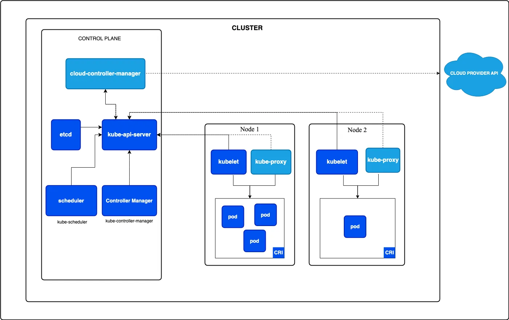
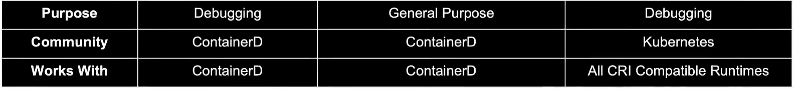
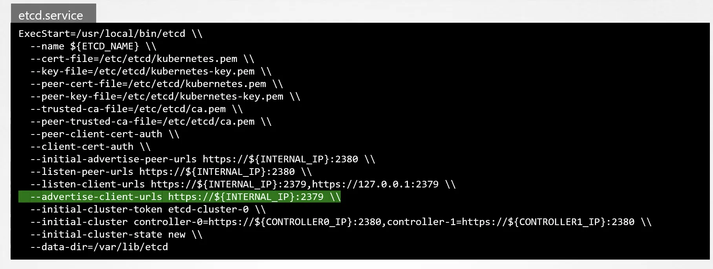

# Core Concepts

### Kubernetes Architecture


- **Nodes** are physical servers, which can be on cloud or on-premise
- **Worker Nodes** host application as container s
- **Master Node** is response to mange, plan, monitor, schedule worker nodes
- `kubelet` in each worker node, is like captain. It’s responsible to introduce the node to master, listen to it, send status, schedule, so on
- Communication between worker nodes (like connection from webserver to db) are enable by `kube-proxy`
- k8s consists lots of components that can be installed and work with each other (like api-server). Each one of these components should be aware of existence of others and where they are, to be able to work with each other. There should be a authentication method between these components.

### Containers

- CRI (Container Runtime Interface) is a standard that any container (like Docker, Containerd, rkt) should’ve implement in their development to be able to used in k8s.
- `containerd` was container part of Docker. But became an independent part a few years ago. Because with k8s we don’t need the components of Docker (like CLI, API, BUILD, AUTH, etc) `containerd`  itself will be used in k8s, not the whole Docker. `containerd` can be installed separately without Docker
- Normally, `containerd` has `ctr` command, which has only very basic commands, which is okay when using k8s. Because k8s will be a middleman. But for debugging purposes, we can use either `nerdctl` which adds commands very similar to Docker commands to `containerd`, or we can use `crictl`, which is compatible with all `CRI` compatible containers systems including `containerd` . It commands also very similar to Docker commands


### ETCD

- **ETCD** is a distributed reliable key-value store that is Simple, Secure and Fast
- After installation and running, use `etcdctl` to deal with keyValues, users, so on. Before starting using `etcdctl` check the version of API using `etcdctl version`
- In k8s, `ETCD` stores information like Nodes, PODs, Configs, Secrets, Accounts, Roles, Bindings, so on. So, setting is only permitted when they reflect on etcd
- If we installed `etcd` manually, we can change the port of `etcd` panel using `etcd.service` file:



- 
    - But if we we installed k8s using `kubeadm`, it already installed etcd as a pod. We can explore database of etcd using etcdctl utility within this pod. For example for getting list of all keys should use `kubectl exec etcd-master -n kube-system ectdctl get / --prefit -keys-only`
    
    
    
- In HA environment, your etcd in each instance should be aware of each other


### Kube-apiserver

- `kube-apiserver` is primary management service in k8s. It sits in the centre of all tasks and changes made on k8s cluster. Actually, `kubectl` command reaches to `kube-apiserver` . It’s the only service that deal with `etcd`.
    - But also, we can use **HTTP requests** directly to `kube-apiserver`, instead of using `kubectl`
- If we installed k8s using `kubeadm`, `kube-apiserver` is installed as a pod. We can see its options within the pod definitions `cat /etc/kubernetes/manifests/kube-apiserver.yaml`


- But if installed k8s manually, we should also install `kube-apiserver` manually. Then we can find its options in `cat /etc/systemd/system/kube-apiserver.service`


- Also we can use `ps -aux | grep kube-apiserver` to see running processes of ApiServer
- When we send a request to kube-apiserver (either via HTTP or `kubectl` ) it follows the following flow by `kube-apiserver`  (this example is pod create command)
    - Authenticate User
    - Validate Request
    - Retrieve data
    - Update ETCD ( → then tells the user pod has been created, but actually it’s not yet)
    - The kube-scheduler will periodically watched `etcd`.
        - In this case, it’ll see there is a pod, with no Node assigned. So, it’ll define which Node should be used to place this pod.
        - Then it asks `kube-apiserver`  to create that pod in the proper node.
        - `kube-apiserver`  will update ETCD again and then send this call to `kubectl` in the desired Node
    - `kubelet` will create the proper containers and the back the status to `kube-apiserver`
        - `kube-apiserver`  updates etcd


### Kube Controller Manager

- Every intelligence in k8s sits inside `Kube Controller Manager`. It has lots of controllers including the one in picture below. They’re all enabled by default when we install Kube Controller Manager, but we can disable any of them


- Controllers are like officers in master ship. Each Controller is responsible for a set of things in workers. One officers is responsible whenever worker ships comes and leave, so on.
So, in kubernetes, Controller is responsible to make sure status of different components are in desired status (**Watch Status, Remediate Situation)**. Eg:
    - Node Controller, checks the status of nodes every 5 sec (is changeable), if is unhealthy, if stays unhealthy for 40 seconds marks is at unhealthy. If it’s unhealthy for 5 minutes, it removes pods assigned to that Node and assign pods to a healthy Node.
    - Replication Controller, makes sure the desired number of pods are available.
- `Kube Controller manager` will be installed automatically if we use `kubeadm` . If we installed K8S manually, we should install Controller Manager as well.
- Its option is located in `controller-manager-master`  pod if we used `kubeadm` or in service file if we installed manually.
    
    
    
    When we install k8s and Controller manager manually
    


1. When install using kubeadm


2. To see options in k8s pod

- To see running `controller-manager` processes, run the following command on master Node: `ps -aux | grep kube-controller-manager`

### Kube Scheduler

- It’s only responsible for deciding which pod goes to which Node. It won’t place pod. Placing pod is responsibility of `kubelet`
- It decides the Node based on requirements and criteria like:
    - Resource Requirements and Limits
    - Taints and Tolerations
    - Node Selector/Affinity
- To we can see options similar to how we did in KubeControllerManager

### Kubelet

- It’s the captain of worker Node. Responsible to Register Nodes in Kubernetes cluster.
- When it receives construction to load a container (from scheduler, but via apiserver), it requests container runtime engine (which maybe Docker) to pull the image and run an instance.
- Monitor the pods and periodically reports status of Pods to apiserver
- unlike previous components, **kubeadm does not automatically deploy Kubectl. We always should install it manually on worker node**.
- We can see option in kubelet.service file. Also for listing running options, run the `ps -aux | grep kubelet` on worker node.

### kube-proxy

- There are different solutions for bring networking between k8s pods. This communication better to not to be with IP due to its inconsistency. Better to use service to connect each other.
But the service itself cannot join pod network by itself, because its just a visual network which lives in k8s memory, not actual component.
So, how services can be joined to pods network? Using **Kube-proxy**. Kube-proxies run  on each Node, and whenever a new services gets created, it creates proper rules (like using `iptables`) on each Node to forward traffic to those services to the backend pods.


- You can install `kube-proxy` manually if you installed k8s manually. Or kubeadm will deploy it as Pod


## Kubenetes Pods

- Pods are the smallest object that you can create on Kubernetes
- Container should be in Pod, it can’t be standalone
- For **scaling purpose, we shouldn’t deploy another container instance in the same Pod**. Instead, it should be a Pod with the new instance.
If our Node doesn’t have enough required capacity for adding more instances, we can add Pod to the next Nodes.


- Sometimes (rarely) we may need to have more than 1 instance in a Pod, like when our main app needs a helper Sqlite DB for its quick operations and that DB isn’t needed to be accessible for other instances or other services. These instances are in the same Pod, and their network is local and isolated. Also, they have access to each other’s storage.


- K8s considers all instances inside a Pod as one object. It shares volumes and volumes of Pod’s instances to each other automatically, it maps them to each other, so on. So, it removes, create the whole Pod completely. It means, for example when the helper DB or the worker app (which sits in the same Pod) gets unhealthy, k8s will kill not only the worker app in that Pod, but even helper DB instance
- For creating Pods, we run the following cmd: `kubectl run nginx --image nginx` .
    - k8s will create Pod for us, and gets nginx image from Docker hub, and create instance inside that Pod.
    - In this example, `--image nginx` means from public Docker hub, but we also can define to get image from private repo
- For listing running Pods: `kubectl get pods` or `kubectl get pods -o wide` for detailed info
    - By default, the created Pod won’t be accessible for end users, but we can access to the instance using k8s itself.
- On `kubectl get pods` command, READY column is: `running containers in pod/total containers in pod`
- To see spec of running Pod: `kubectl describe pod myapp-pod`
- For deleting pods: `kubectl delete pods mywebapp`

### K8s YAML files

- Kubernetes uses yaml files as inputs for creation of objects like Pods, replicas, services, deployments, etc. It always have the 4 top level fields: `apiVersion, kind, metadata, spec`

```yaml
// Take care of indents. Siblings should be in the same
   level of indents, and child of parent should have more
   indent compared to parent
apiVersion: v1 //refer to table
kind: Pod
metadata:
// all key-values inside metadata should be in k8s defined
	list, like name, labales, so on
	name: myapp-pod 
	labels:
	// but keys inside labels can be anything
		app: myapp
		// We can use such fields to different purpose, like filterring:
		type: frontend 
spec:
	containers:
	// for each item of list, we use '-':
		- name: nginx-container
			image: nginx
```

- Once you created the config file, you can create Pod using `kubectl create -f pod-definition.yml` or `kubectl apply -f pod-definition.yml`
- 

| Kind | Version |
| --- | --- |
| Pod | v1 |
| Service | v1 |
| ReplicaSet | apps/v1 |
| Deployment | apps/v1 |

### Exam notes

- k8s in exam has been installed using `kubeadm`  which
    - already deployed etcd, Kube-Apiserver, Kube-Scheduler, Kube-Controller-Manager as Pods