# Core Concepts

### Kubernetes Architecture

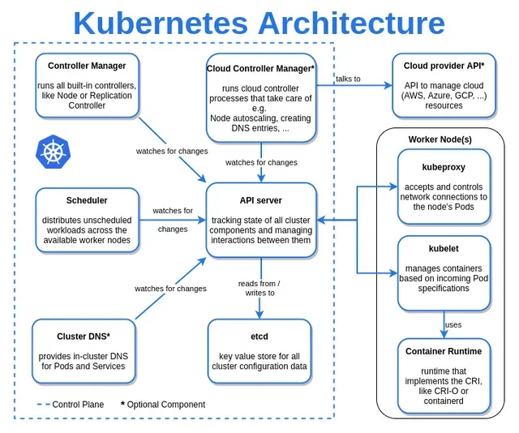


- **Nodes** are physical servers, which can be on cloud or on-premise
- **Worker Nodes** host application as container s
- **Master Node** is response to mange, plan, monitor, schedule worker nodes
- `kubelet` in each worker node, is like captain. It’s responsible to introduce the node to master, listen to it, send status, schedule, so on
- Communication between worker nodes (like connection from webserver to db) are enable by `kube-proxy`
- k8s consists lots of components that can be installed and work with each other (like api-server). Each one of these components should be aware of existence of others and where they are, to be able to work with each other. There should be a authentication method between these components.

### Containers

- CRI (Container Runtime Interface) is a standard that any container (like Docker, Containerd, rkt) should’ve implement in their development to be able to used in k8s.
- `containerd` was container part of Docker. But became an independent part a few years ago. Because with k8s we don’t need the components of Docker (like CLI, API, BUILD, AUTH, etc) `containerd`  itself will be used in k8s, not the whole Docker. `containerd` can be installed separately without Docker
- Normally, `containerd` has `ctr` command, which has only very basic commands, which is okay when using k8s. Because k8s will be a middleman. But for debugging purposes, we can use either `nerdctl` which adds commands very similar to Docker commands to `containerd`, or we can use `crictl`, which is compatible with all `CRI` compatible containers systems including `containerd` . It commands also very similar to Docker commands
  

### ETCD

- **ETCD** is a distributed reliable key-value store that is Simple, Secure and Fast
- After installation and running, use `etcdctl` to deal with keyValues, users, so on. Before starting using `etcdctl` check the version of API using `etcdctl version`
- In k8s, `ETCD` stores information like Nodes, PODs, Configs, Secrets, Accounts, Roles, Bindings, so on. So, setting is only permitted when they reflect on etcd
- If we installed `etcd` manually, we can change the port of `etcd` panel using `etcd.service` file:


- - But if we we installed k8s using `kubeadm`, it already installed etcd as a pod. We can explore database of etcd using etcdctl utility within this pod. For example for getting list of all keys should use `kubectl exec etcd-master -n kube-system ectdctl get / --prefit -keys-only`
    
    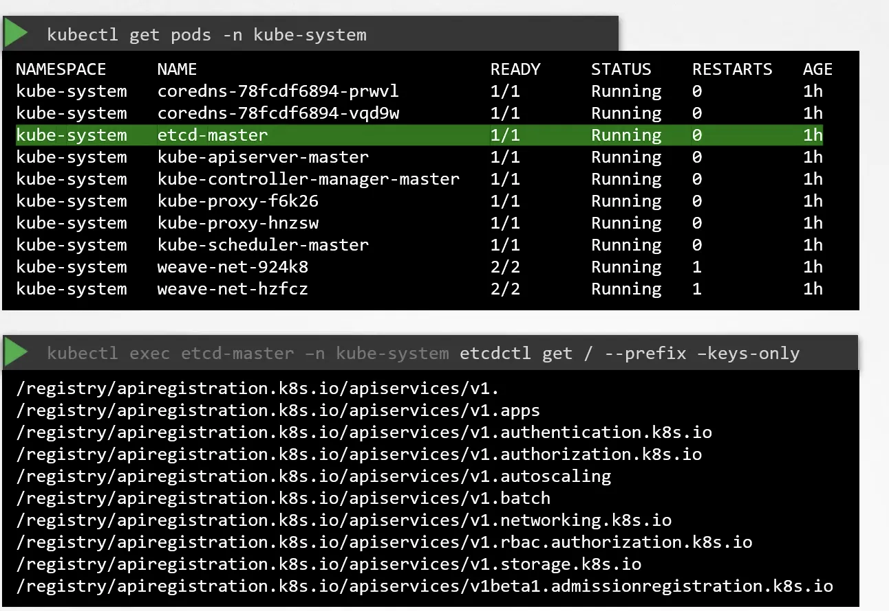

- In HA environment, your etcd in each instance should be aware of each other

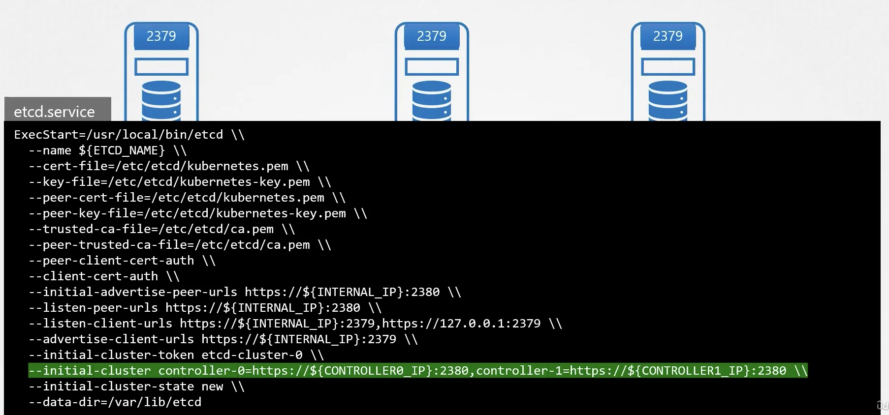

- To find out whether the ETCD of a node is Stacked (inside the node itself) or an external ETCD, check with 2 methods:
  - Check, `etcd` Pod exist in Pods list alongside other kube Pods. If exists, ETCD is most likely Stacked If exists, ETCD is most likely Stacked
  - Check if there are static Pod definitions for other components (like kube-scheduler) in `/etc/kubernetes/manifests/`, but not for ETCD.
  - Run `k describe -n kube-system pod kube-api-server...` and look at `--etcd-servers`. If the IP was local IP (127.0.0.1:xxxx), then it's Stacked ETCD. If it's not local, then it's external ETCD, that that IP is IP of that external ETCD server.

- If you're in a machine that has standalone ETCD (without kubernetes) and want to see ETCD description, run `ps -ef | grep -i etcd` or `ps -aux | grep -i etcd`
- If we want to know how many nodes are part of a etcd-cluster, run `ETCDCTL_API=3 etcdctl member list --endpoints={endpointUrl} --cert={certFile} --key={keyFile} --cacert={caCertFile}`. Now, count the result lines.

### Kube-apiserver

- `kube-apiserver` is primary management service in k8s. It sits in the centre of all tasks and changes made on k8s cluster. Actually, `kubectl` command reaches to `kube-apiserver` . It’s the only service that deal with `etcd`.
  - But also, we can use **HTTP requests** directly to `kube-apiserver`, instead of using `kubectl`
- If we installed k8s using `kubeadm`, `kube-apiserver` is installed as a pod. We can see its options within the pod definitions `cat /etc/kubernetes/manifests/kube-apiserver.yaml`

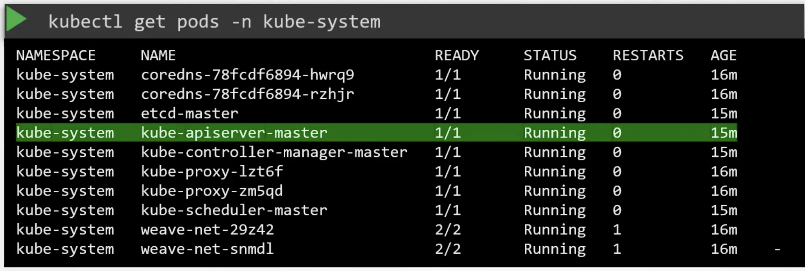

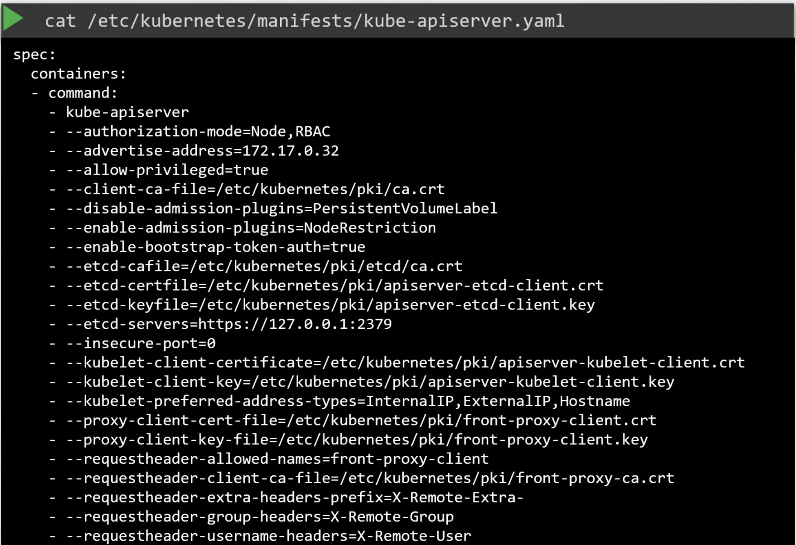

- But if installed k8s manually, we should also install `kube-apiserver` manually. Then we can find its options in `cat /etc/systemd/system/kube-apiserver.service`

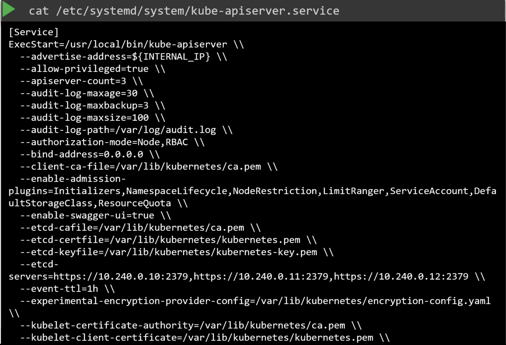

- Also we can use `ps -aux | grep kube-apiserver` to see running processes of ApiServer
- When we send a request to kube-apiserver (either via HTTP or `kubectl` ) it follows the following flow by `kube-apiserver`  (this example is pod create command)
  - Authenticate User
  - Validate Request
  - Retrieve data
  - Update ETCD ( → then tells the user pod has been created, but actually it’s not yet)
  - The kube-scheduler will periodically watched `etcd`.
    - In this case, it’ll see there is a pod, with no Node assigned. So, it’ll define which Node should be used to place this pod.
    - Then it asks `kube-apiserver`  to create that pod in the proper node.
    - `kube-apiserver`  will update ETCD again and then send this call to `kubectl` in the desired Node
  - `kubelet` will create the proper containers and the back the status to `kube-apiserver`
    - `kube-apiserver`  updates etcd

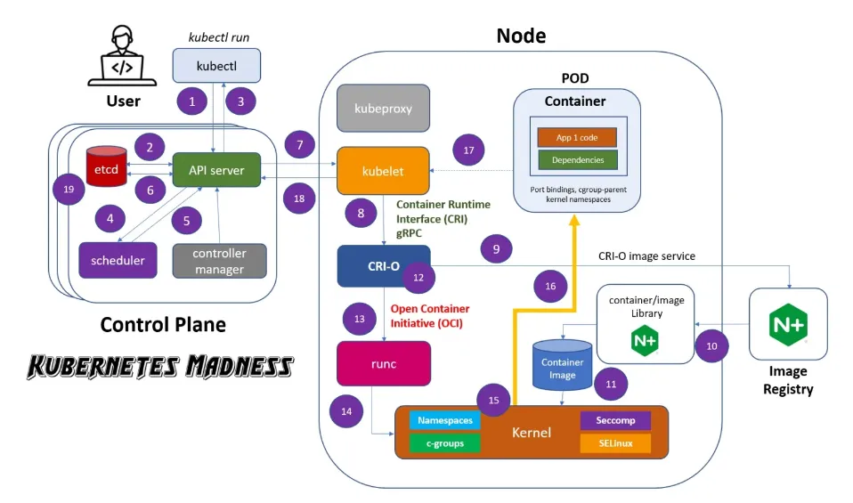

### Kube Controller Manager

- Every intelligence in k8s sits inside `Kube Controller Manager`. It has lots of controllers including the one in picture below. They’re all enabled by default when we install Kube Controller Manager, but we can disable any of them

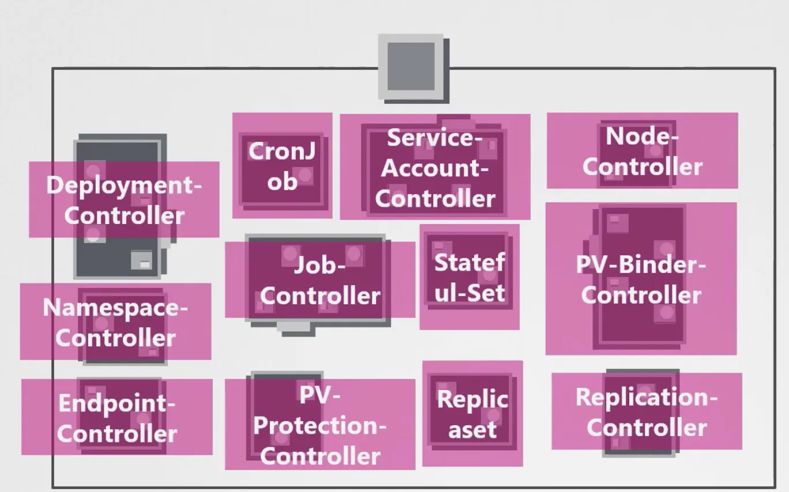

- Controllers are like officers in master ship. Each Controller is responsible for a set of things in workers. One officers is responsible whenever worker ships comes and leave, so on.
  So, in kubernetes, Controller is responsible to make sure status of different components are in desired status (**Watch Status, Remediate Situation)**. Eg:
  
  - Node Controller, checks the status of nodes every 5 sec (is changeable), if is unhealthy, if stays unhealthy for 40 seconds marks is at unhealthy. If it’s unhealthy for 5 minutes, it removes pods assigned to that Node and assign pods to a healthy Node.
  - Replication Controller, makes sure the desired number of pods are available.

- `Kube Controller manager` will be installed automatically if we use `kubeadm` . If we installed K8S manually, we should install Controller Manager as well.

- Its option is located in `controller-manager-master`  pod if we used `kubeadm` or in service file if we installed manually.
  
    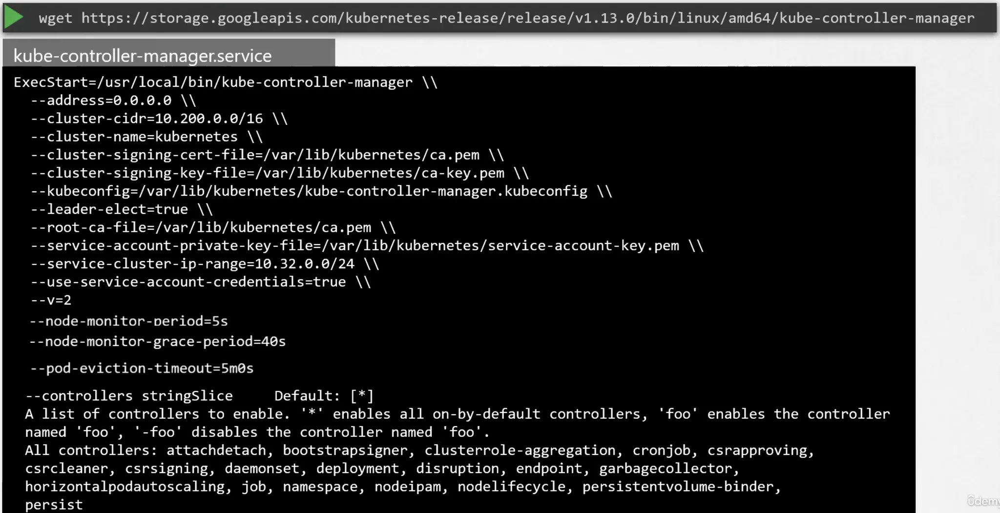
  
    When we install k8s and Controller manager manually

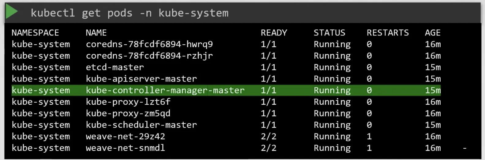

1. When install using kubeadm

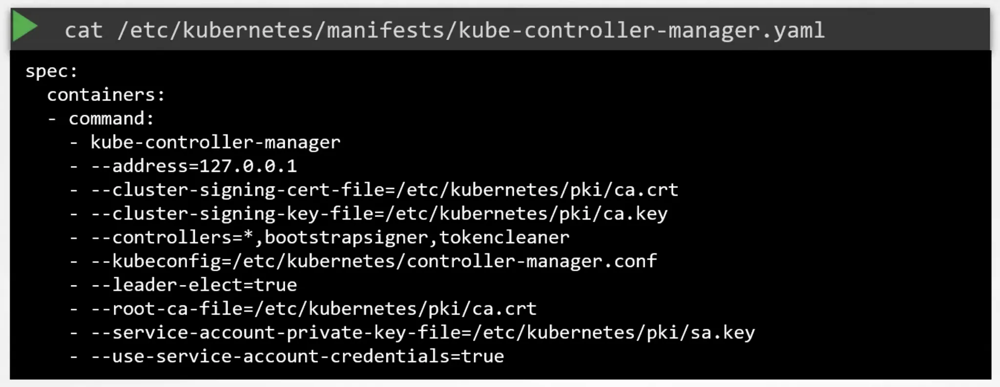

2. To see options in k8s pod
- To see running `controller-manager` processes, run the following command on master Node: `ps -aux | grep kube-controller-manager`
- Navigate to sector **Controller Manager** below to to learn about each controllers

### Kubelet

- It’s the captain of worker Node. Responsible to Register Nodes in Kubernetes cluster.
- When it receives construction to load a container (from scheduler, but via apiserver), it requests container runtime engine (which maybe Docker) to pull the image and run an instance.
- Monitor the pods and periodically reports status of Pods to apiserver
- unlike previous components, **kubeadm does not automatically deploy Kubectl. We always should install it manually on worker node**.
- We can see option in kubelet.service file. Also for listing running options, run the `ps -aux | grep kubelet` on worker node.

### kube-proxy

- There are different solutions for bring networking between k8s pods. This communication better to not to be with IP due to its inconsistency. Better to use service to connect each other.
  But the service itself cannot join pod network by itself, because its just a visual network which lives in k8s memory, not actual component.
  So, how services can be joined to pods network? Using **Kube-proxy**. Kube-proxies run  on each Node, and whenever a new services gets created, it creates proper rules (like using `iptables`) on each Node to forward traffic to those services to the backend pods.

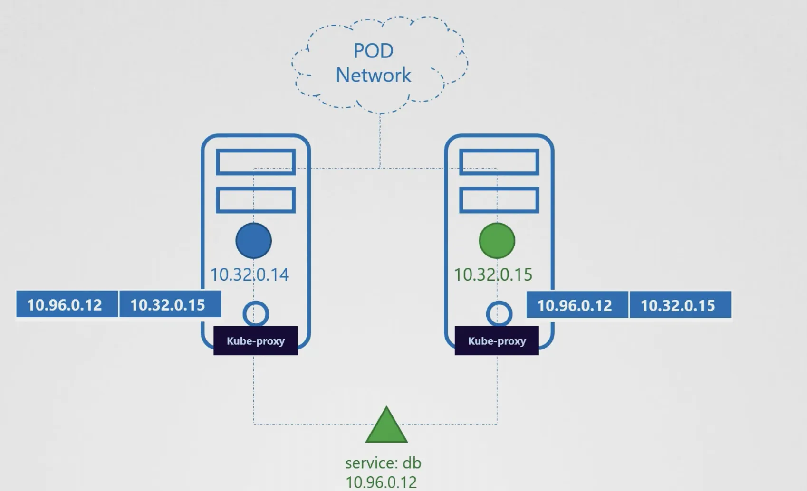

- You can install `kube-proxy` manually if you installed k8s manually. Or kubeadm will deploy it as Pod

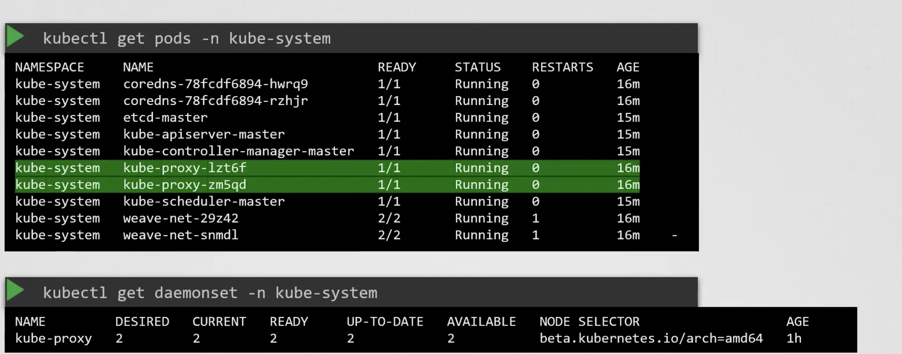

## Kubenetes Pods

- Pods are the smallest object that you can create on Kubernetes
- Container should be in Pod, it can’t be standalone
- For **scaling purpose, we shouldn’t deploy another container instance in the same Pod**. Instead, it should be a Pod with the new instance.
  If our Node doesn’t have enough required capacity for adding more instances, we can add Pod to the next Nodes.

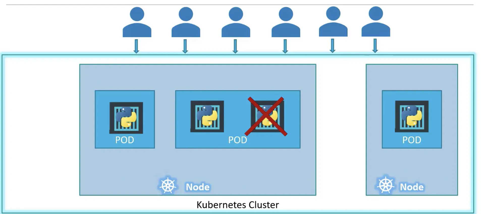

- Sometimes (rarely) we may need to have more than 1 instance in a Pod, like when our main app needs a helper Sqlite DB for its quick operations and that DB isn’t needed to be accessible for other instances or other services. These instances are in the same Pod, and their network is local and isolated. Also, they have access to each other’s storage.

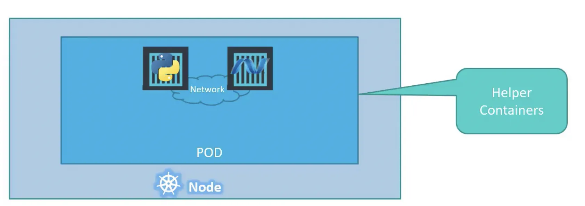

- K8s considers all instances inside a Pod as one object. It shares volumes and volumes of Pod’s instances to each other automatically, it maps them to each other, so on. So, it removes, create the whole Pod completely. It means, for example when the helper DB or the worker app (which sits in the same Pod) gets unhealthy, k8s will kill not only the worker app in that Pod, but even helper DB instance
- For creating Pods, we run the following cmd: `kubectl run nginx --image=nginx` .
  - k8s will create Pod for us, and gets nginx image from Docker hub, and create instance inside that Pod.
  - In this example, `--image=nginx` means from public Docker hub, but we also can define to get image from private repo
- For listing running Pods: `kubectl get pods` or `kubectl get pods -o wide` for detailed info
  - By default, the created Pod won’t be accessible for end users, but we can access to the instance using k8s itself.
- On `kubectl get pods` command, READY column is: `running containers in pod/total containers in pod`
- To see spec of running Pod: `kubectl describe pod myapp-pod`
- For deleting pods: `kubectl delete pods mywebapp`

### K8s YAML files

- Kubernetes uses yaml files as inputs for creation of objects like Pods, replicas, services, deployments, etc. It always have the 4 top level fields: `apiVersion, kind, metadata, spec`

```yaml
# Take care of indents. Siblings should be in the same
#   level of indents, and child of parent should have more
#   indent compared to parent
apiVersion: v1 //refer to table below
kind: Pod
metadata:
# all key-values inside metadata should be in k8s defined
#    list, like name, labales, so on
    name: myapp-pod 
    labels:
#      but keys inside labels can be anything
        app: myapp
#        We can use such fields to different purpose, like filterring:
        type: backend 
spec:
    containers:
#      for each item of list, we use '-':
        - name: nginx-container
          image: nginx
```

| Kind                                | Version |
| ----------------------------------- | ------- |
| Pod                                 | v1      |
| Service                             | v1      |
| ReplicaSet                          | apps/v1 |
| Deployment                          | apps/v1 |
| ReplicationController (Deperacated) | v1      |

- We can also create definition YAML file by adding `dry-run` argument, like:
  
  ```bash
  kubectl run redis --image=redis --dry-run=client -o yaml > redis-pod-def.yaml
  ```

- Once you created the config file, use `kubectl create -f pod-definition.yml` for creating or use `kubectl apply -f pod-definition.yml` for upsert (insert or update)

## ReplicationController / ReplicaSet

- Why we need ReplicationController?
  
  1. Maintain desired number of replicas to make sure our app is always available. Replica number can be 1 (means only one instance of that app is running at the time). But 2 is better if we have HA (high availability) in mind.
     
     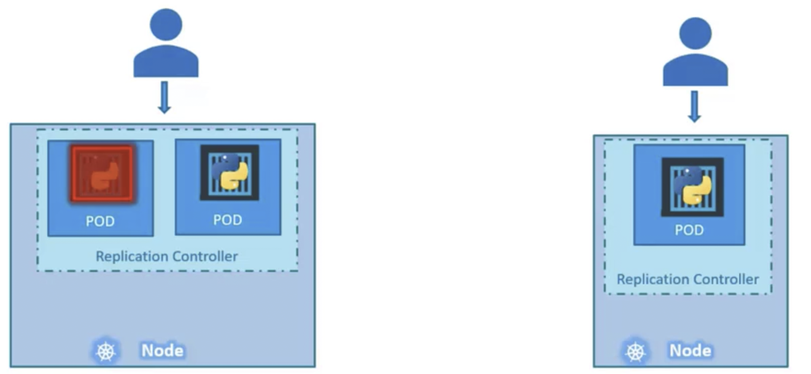
  
  2. Load balancing & Scalability. ReplicationController will make sure request load will splitted in all replicas. It can even deploy replicas in other Nodes if required
     
     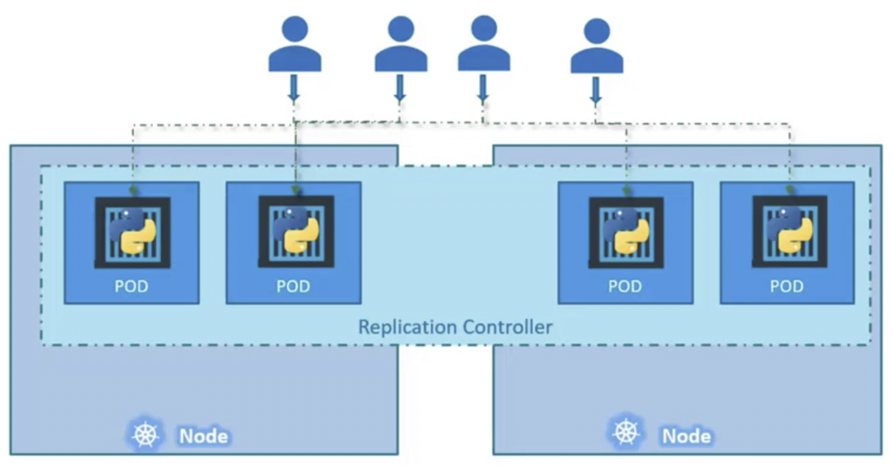

- **ReplicationController** and **ReplicaSet** does the same thing, but they're not the same. **ReplicaSet** is a newer version and have more capability, like `selector` in definition file.

- In `spec > template` section of definition YAML file, we should have the exact code in Pod definition file except `apiVersion` and `kind` fields.

- In **ReplicaSet** manager, we can define `selector` inside `spec` section. We define it to let ReplicaSet controller know that even if we deployed the similar Pod/app manually, count them as your replicas. **ReplicationController** doesn't have selector section. Sample definition file:
  
  ```yaml
  # apiVersion if kind:ReplicationController
  apiVersion: apps/v1
  kind: ReplicaSet
  metadata:
    name: myapp-replicaset
    labels:
      app: myapp
      type: backend
  spec:
    replicas: 3 
  # define 'selector' only if kind is ReplicaSet
    selector:
  # matchLabels will be used to consider all Pods with this labels (even manually created) part of this replica
  # Also the values inside matchLabels should match labels in template section below
      matchLabels:
        type: backend
  # Inside 'template' should be exactly desired Pod definition
    template:
      metadata:
        labels:
          type: backend
      spec:
        containers:
          - name: myapp
            image: redis
  ```

- For creating using replicaset or replicationController:

  ```bash
  kubectl apply -f my_replica.yaml
  ```

- To see Repli status, use one of the following
  
  ```bash
  # For replicationcontroller
  kubectl get replicationcontroller
  # For replicaset
  kubectl get replicaset
  # or
  kubectl get rs
  ```
  
  - But you still can use `kubectl get pods` to list pods, you'll see replicationController added a suffix to each replica

- To delete replicaset all all underlying PODs (ReplicationController is similar):
  
  ```bash
  kubectl delete replicaset my-replica
  ```

- To edit replica set, use the following command:
  
  ```bash
  kubectl edit replicaset my-replica
  ```
  
  - The changes related to POD (like POD image) won't be reflected on existing PODs of replica. You should delete them, and new ones will be created using the edited definition.
    But changings related to Replica itself (replica number) will reflected immediately 

**Scaling Replicas**

- We can either
  
  - Update YAML file, change replica value, and then run `kubectl replace -f my-replica.yaml` command
  
  - Or change replicas temporarily using `kubectl scale --replicas=5 -f my-replica.yaml`
  
  - Or by defining the name of the created replica, instead of yaml file name `kubectl scale --replicas=5 [TYPE] [NAME]` like `kubectl scale --replicas=5 replicaset my-replicaset`

**Deployments**

- Kubernetes can handle different scenarios and strategies related to deployment to production env. Like:
  
  - Deploying app to multiple instances
  
  - Upgrading the existing docker instances gradually, not all at once
  
  - Rollback the changes recently been made
  
  - Pause, upgrade and then resume instances whenever we want to update underlying configurations of pods

- Deployments in a higher hierarchy to ReplicaSet
  
  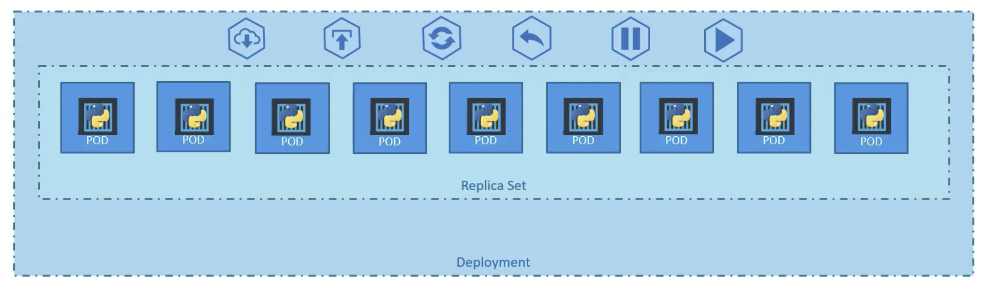

- Definition file of Deployments is very similar to ReplicaSet, except the `kind` field which should be `Deployment`

- You can created Deployments either using command, or definition file:
  
  1. Use `kubectl create -f my-deployment.yaml` to create deployment from definition file.
  
  2. Use command like `kubectl create deployment httpd-frontend --image=httpd:2.4-alpine --replicas=3` 

- Use `kubectl get deployment`  or `kubectl get deploy` to list created deployments. Or use `kuectl get all` to list all 

## Services

- Kubernetes services enables communication between the components inside and outside of application. It helps to connect applications to other applications or users, like communication between front-end and backend, or between user and frontend
  
  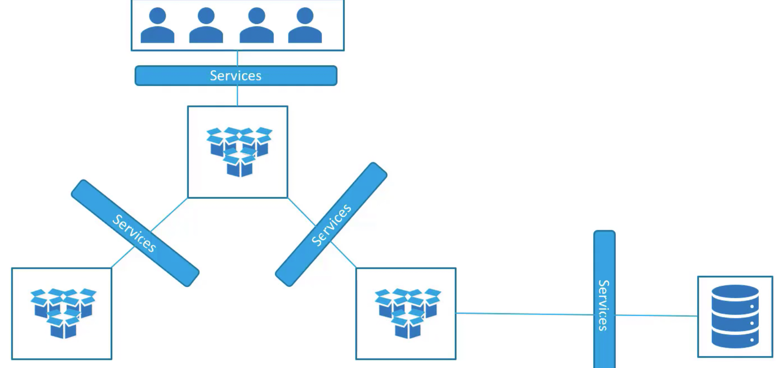

- Normally, the application inside k8s is not accessable from outside, excpet if we connect to k8s Node via SSH. 
  
  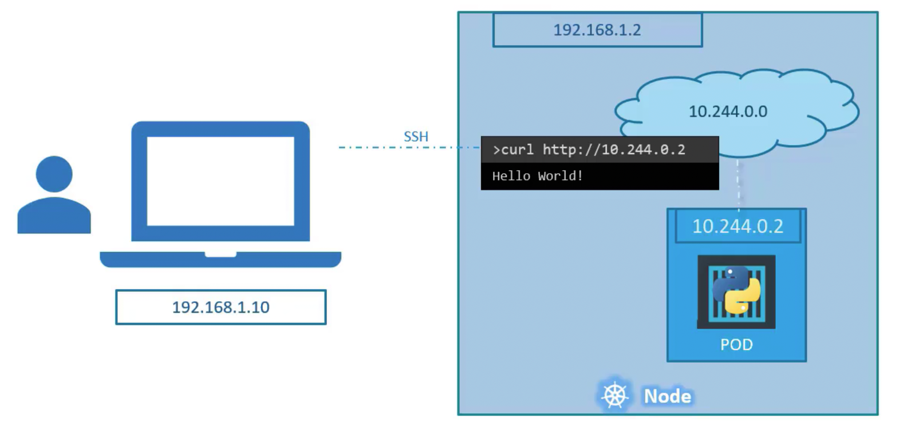
  
  - But using service, we can give access:
  
  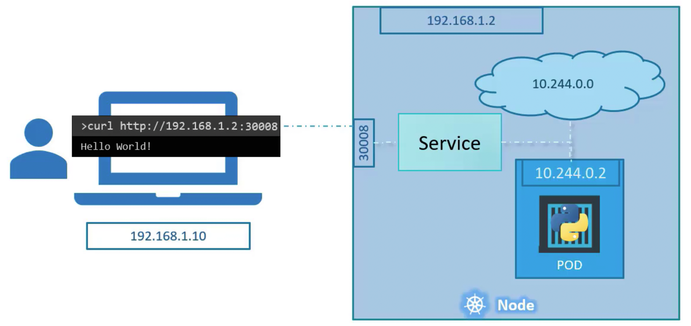

- **Services Type**:
  1.  **NodePort**: To give incoming access to the Pod from ouside of the Node

    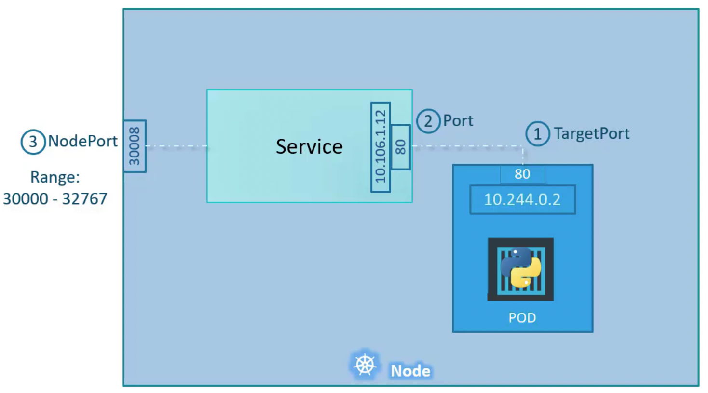

    - NodePort range is `30_000` to `32_767`

  2. **CluesterIP**: Create virtual IP inside cluster to enable communication between Pods like set of front-end servers with back-end servers
      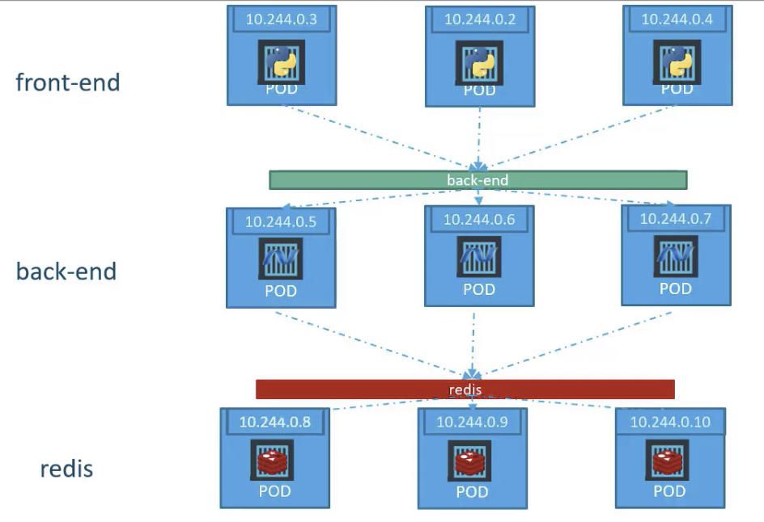
  3. **LoadBalancer**: Enables loadBalancer in the supported cloud providers (like AWS, GCP, Azure). For example we pub AWS Application Load Balancer in front and Kubernetes service (with type=LoadBalancer) will do the rest of configuration in a way that the traffic will be received through the domain that is set to AWS ALB, and load will be balanced.
    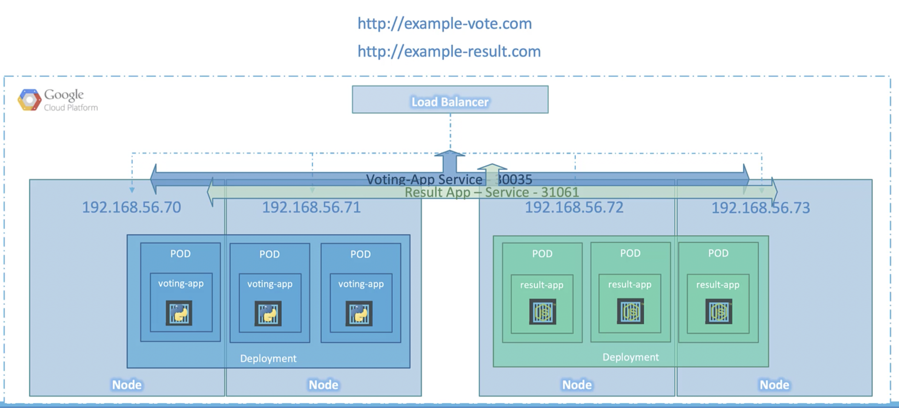
    - Note that we still can access to underlying Pods using IP:PORT of any of the Pods as example below. But that't not our desired way of accessing. We want a single URL.
      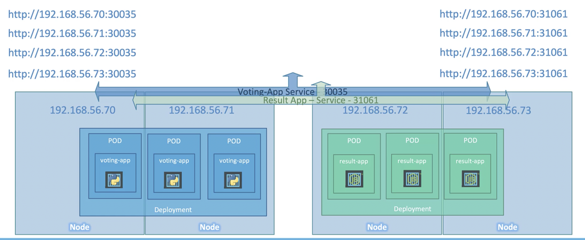
- Sample of definition file:

  ```yaml
  apiVersion: v1
  kind: Service
  metadata:
    name: my-service
  spec:
    # Possible options for type are: ClusterIP, NodePort, LoadBalancer
    #   Default value is ClusterIP if we don't define. 
    type: NodePort 
    ports:
      - targetPort: 80 # if we don't define targetPort, will be equal to port
        port: 80
        # We don't define nodePort in ClusterIP
        nodePort: 30008 # If we don't define, it'll be first available nodePort
    selector: # K8s uses selector, to know which Pods should be targetted.
      app: myapp
      type: front-end
  ```
- If there are more than one Pod for the specifiec 'Selector', the service will act as the load balancer and will split traffic to all targets using `Random` Algorithm. These multiple pods can be in one Node, or in multiple Nodes. Then we can use IP of any of the target Nodes to access underlying Pods of service. In the following picture `curl http://192.168.1.2:300008` or `curl http://192.168.1.3:300008` or `curl http://192.168.1.4:300008`

  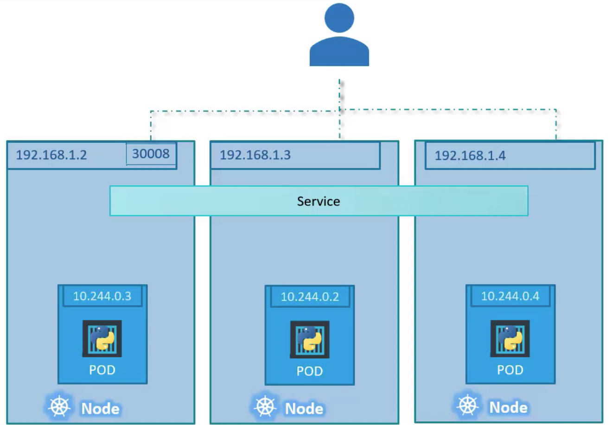
  
- To create service using definition file, use `kubectl create -f my-service.yaml` and for listing the running services: `kubectl get services` or `kubectl get svc`
- For creating service we can use both `create service` and `expose pod` command as below:
  - `kubectl expose pod nginx --type=NodePort --port=80 --name=nginx-service --dry-run=client -o yaml`
  - `kubectl create service nodeport nginx --tcp=80:80 --node-port=30080 --dry-run=client -o yaml`
  - Actually, `expose` command detects labels of pod and uses them for service.
- We can even combine Pod creation and exposing service with this:
  - `kubectl run nginx --image=nginx --port=80 --expose=true`
- Kubernetes creates a ClusterIP in the beginning for us (I still don't know the reason behind)

## Namespaces

- Namespaces is like houses. People in the house (family members) call each other with their first name only. They all have access to shared resources. But when family members want to call members of other family, they should call their fullname.
  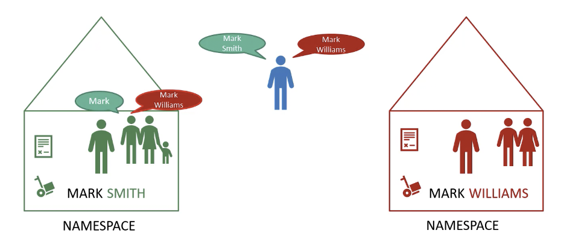
- Namespeces isolates its components (like Pods, etc) so they can't be altered by mistake. For example, we won't remove Pods in `prod` namespaces instead of `dev` by mistake.
- Kubernetes automatically creates a `default` namespace for us in the creation of a cluster, and all our Pods, etc are creating in this NS. Kubernetes also craetes other Namespaces (like kube-public and kube-system) to isolate its critical components and prevent modification by mistake.
- If we're environment and/or clluster is small, just keep using the `default` NS. But if you want to go with enterprise level setup, you can create NSes like `dev` and `prod` and so on.
- If we access a DB in current NS using `mysql.connect("db-service")`, for accessing DB in another NS we should use `mysql.connect("db-service.dev.svc.cluster.local")`. More details about this format:
  - `cluster.local` default domain name of k8s cluster
  - `svc` subdomain for service
  - `dev` actual namespaces
  - `db-service` service name
- Commands:
  - `kubectl get po --namespace=dev` : --namespace is used to get resoruces in other namespaces than current one
  - `kubectl create -f my-pod.yaml --namespace=dev` . You can define which namespace the resource should created in. Another way is adding `namespace: dev` in `metadata` section of definition file.
  - To create namespace, you can either use command `kubectl create namespace dev` or using definition file:
    ```yaml
    apiVersion: v1
    kind: namespace
    metadata:
      name: dev
    ```
  - To set another namespace as current NS, use:
    - `kubectl config set-context $(kubectl config current-context) --namespace=dev`. Or `kubectl config set-context --current --namespace=dev`
    - Now you switch to this NS and don't need to define `--namespace` parameter to accessing resources in it.
  - To view resources in name spaces, use `--all-namespaces`, like `kubectl get po --all-namespace`
- We can define policies for each NS using Quotas, either using command parameters or definition file:
  ```yaml
  apiVersion: v1
  kind: ResourceQuota
  metadata:
    name: compute-quota
    namespace: dev
  spec:
    hard:
      pods: "10"
      requests.cpu: "4"
      requests.memory: 5Gi
      limits.cpu: "10"
      limits.memory: 10Gi
  ```

## Namescope bound vs Cluster scoped
- Some resources are bounded to namespaces. But others are in Cluster level and can't be bounded to a specific namespace. Some examples are:
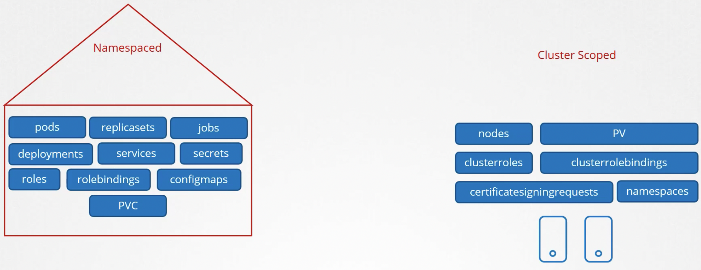

- To see Cluster scope run `kubectl api-resources --namespaced=false` and for Namespace scope resources run `kubectl api-resources --namespaced=true`
- For getting list of cluster level resources (like Nodes, ClusterRoles, etc), you can't define `--all` or `-A` paramater.

## Imperative vs Declarative
Kubernetes have 2 ways of managing infrastructure:

**1. Imperative**: Means we tell k8s what steps should it follow to reach to the desired infra. All the following commands are Imperative:
- `kubectl run --image=nginx nginx`
- `kubectl create deployment --image=nginx nginx`
- `kubectl expose deployment nginx --port 80`
- `kubectl edit deployment nginx` . By this command, we make change on the running deployment (which is not persistent). The actual YAML file will stay unchanged. For making changes consistent, use replace.
- `kubectl scale deployment nginx --replicas=5`
- `kubectl set image deployment nginx nginx=nginx:1.18`
- `kubectl create -f nginx.yaml`
- `kubectl replace -f nginx.yaml` . By updating the YAML file and use replace command, both config file and the running deployment will be updated.
  - `kubectl replace --force -f nginx.yaml` . If you want to completely delete objects
- `kubectl delete -f nginx.yaml`  
  
In the above comamnds, you as administrator is responsible to final result. For example, before running `replace` command, you should make sure that resource exists, or before running `create` make sure the resource doesn't exist, otherwise you'll get error.


**2. Declarative**: Means we define the desired infra, k8s will decide what approach it should follow to reach the desired infra. For example, before creating the Replica, it checks whether it exists of not. The following command is declerative:
- `kubectl apply -f nginx.yaml` . It's intelligent and will check resource exists before running. It's like *Upsert* in SQL.
  - `kubectl apply -f /path/to/config-files` . To apply for all definition files in a path
- When we use `apply` command, k8s compares the *Live object configuration* with the local file. Then, it updates the live object. But before updating, it creates a copy of *Live object configuration* and put in `annotation` section of the live object configuration. So we can always see what was the latest config before the current one:
  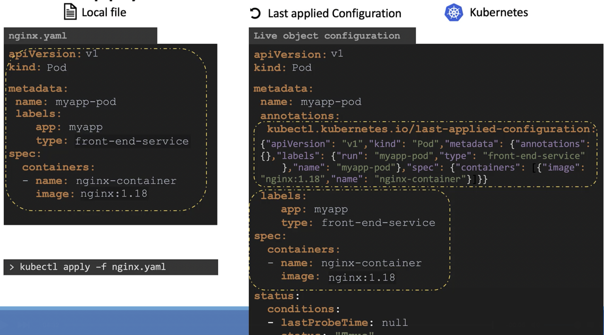

## Labels & Selectors
- Labels in k8s are like tags in AWS or in YouTube post. It's for assigning resources to different groups. So, we can use tags to select those resources together.
- You can as many labels as you want for your resource.
- Also, if we want a group of resource been used together by another resource (Like Pods been used by a ReplicaSet), we use labels.
- For getting resources by labels, use like this `--selector app=Frontend` or `-l app=Frontend`. If we want to get resources that have multiple tags (all are must) use colon like `-l app=FE,env=dev`
- *Annotations* field is also been used for other informative data
```yaml
# ...
metadata:
  name: simple-app
  labels: # ...
  annotations:
    buildversion: 1.22
# ...
```

## Pod Extra Notes
- We can edit only the following specifications of a Pod:
  - `spec.containers[*].image`
  - `spec.initContainers[*].image`
  - `spec.activeDeadlineSeconds`
  - `spec.tolerattions`
  - If we try to edit other specs, k8s will give a "Forbidden" error and will save our changes in a temp YAML file. So, for editing those forbidden specs, we have 2 ways:
    1.  After k8s saved our edits in a temp file, we'll delete the Pod and create new one using that temp file
    2. Before deleting the Pod, export the definition using `k get po {PodName} -o yaml > {OutputDefFile}`. Then delete the Pod and create new one using the newly created def file.
  - But if we edit the Deployment that has Pods inside, the Deployment will delete Pods and create new ones using the edited definition.
  - Note: Instead of delete and recreate, we can use `replace --force` command
- To run commands on Pod (sleep in this example):
  ```yaml
  # ...
  spec:
    containers:
      - image: nginx 
        name: nginx
        command:
          - sleep
          - "1000"
  ```
  or you can generate YAML file using dry-run `k run my-nginx --image=nginx --dry-run=client -o yaml --command -- sleep 1000`. Note that `--` part should be at the end.
- To see what's the owner of the Pod (like ReplicaSet, Deployment, etc), get yaml of Pod using `kubectl get pod {PodName} -n {Namespace} -o yaml` and look for `ownerReferences -> kind`.
- To run a command in a container in ad Pod, run `kubectl exec -it <podName> -- <command>`, for example:
  - `k exec -it myPod -- cat /logs/logs.txt` to print content of logs.txt file
  - `k exec -it myPod -- sh` to enter interactive command line of the container.

## Cluster, Node and Namespace extra Notes
- To see Node info (like how many clusters does it have access to), run `k config view`
- To switch the cluster, use `k config use-context {clusterName}`
- To find out current cluster and context, run ` k config get-contexts`
- To set default namespace, use `k config set-context --current --namespace={namespaceName}`

# Scheduler
## Fundamentals
- The Scheduler is a key component in Kubernetes that automatically chooses which Node runs each Pod. It won’t place pod. Placing pod is responsibility of `kubelet`
- It decides the Node based on requirements and criteria like:
  - Resource Requirements and Limits
  - Taints and Tolerations
  - Node Selector/Affinity
- There will be a default scheduler in `kube-system` namespace. If that doesn't work well, our new created Pods will be in `Pending` status because Scheduler is not there to place the Pod in the proper Node.
- Manually setting `nodeName` overrides the Scheduler, forcing a Pod onto a specific Node (or failing if that Node is unsuitable):
  ```yaml
  apiVersion: v1
  kind: Pod
  # ...
  spec:
    containers:
    # ...
    nodeName: node02 # This field
  ```
- Pod Node can be defined in creation time only. We can't move a running Pod. If we want to assign a node an existing Pod, we should use POST call to Pod's binding API. The following *Pod bind definition* file.
  ```yaml
  apiVersion: v1
  kind: binding
  metadata:
    name: nginx
  target:
    apiVersion: v1
    kind: Node
    name: node02
  ```
    But we we won't use this YAML file. We'll use the equivalent JSON in the POST:

    `curl --header "Content-Type:application/json" --request POST --data '{"apiVersion":"v1", "kind": "Binding", ...} http://$SERVER/api/v1/namespaces/default/pods/$PODNAME/binding/`
## Taint and Tolerants
- Explanation Taint and Tolerans: Imaging there is a room with humans and bugs. The bugs approach people to land of them. They can land on anyone they want (randomly). But if a person sprays on him (we call it taint), the bugs will run away from him. As an expection, any of the bugs are tolerant to that spray, that bug can land on the person.
  We can similar concept for k8s. If we add taint to Nodes, only the bugs that have equivalent tolerant can be sheduled on the Node.
- The taint to Node will be in this format: `kubectl taint nodes {node_name} {key}={value}:{taint-effect}`
  - `taint-effect` possible options:
    - `NoSchedule` : Means new Pods shouln't be deployed (scheduled) without matching tolerant
    - `PreferNoSchedule` : *Try* to not schedule new Pods without matching tolerant, but it's not guaranteed
    - `NoExecute` : Applies both for new Pods and existing Pods. Means event if a tolerant of a Pod in the Node doesn't match the taint, it'll be killed. This eviction doesn't guarantee recreation of the Pod. If the Pod had Deployment or other controller, it will be recraeted by it. Otherwise, the Pod won't be recreated.
  - Sample command: `kubectl taint nodes node1 app=blue:NoSchedule`
- Taint & Tolerant is only for **Preventing** Pods from placing on certain Nodes, not **Forcing**. For Forcing, we'll use **Node Affinity**.
- Then we should define the matching tolerants in the Pods we want to sit in that Node:
  ```yaml
  apiVersion: v1
  kind: Pod
  # ...
  spec:
    containers: #...
    tolerations:
    - key: "app" 
      operator: "Equal"
      value: "blue"
      effect: "NoSchedule"
- Master Node in k8s is also a Node, line Worker Nodes. Why scheduler doesn't schedule any Pods on Master Node? Because Master Node has a taint on it (try to not modify this taint):
  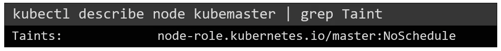
- To remove taint from a Node, either use "key" or "key+effect" with "-" at the end:
  - `kubectl taint no node01 app-`
  - `kubectl taint no node01 app:NoSchedule-`
- On craetion of a Pod, if Pod doesn't have matching tolerant for any of the Nodes, it'll stay on the "Pending" state. But as soon as we modify a Node that become taint-less or taint with matching the Pod's tolerant, the scheduler will place Pod in that Node.

## Node Selectors
- Using labels/selectors, we can define which Nodes our Pod can deployed in, using labels.
- To do this, we add label to Node(s) using:
  - `kubectl label nodes {node_name} {label-key}={label_value}` Like `kubectl label no node01 size=Large`
  - Then set selector in Pod(s):
  ```yaml
  kind: Pod
  #...
  spec:
  #...
    nodeSelector:
      size: Large
  ```
- Node Selector is very limited. E.g we can define multiple filter, or we can't define NOT operator. For advanced usages, use Node Affinity
- To see Node labels, other than `describe` comamnd, we can use `k get nodes --show-labels`

## Node Affinity
- Using Node Affinity, we can specify complex Node Selectors to Pod. 
- Possible values for Node Affinity Types are:
  | Type | During Scheduling | During Execution | Notes |
  | ---- | ----------------- | ---------------- | ----- |
  | `requiredDuringSchedulingIgnoredDuringExecution` | Required | Ignored | - |
  | `preferredDuringSchedulingIgnoredDuringExecution` | Preferred** | Ignored | - |
  | `preferredDuringSchedulingRequiredDuringExecution` | Required | Required | Planned, not available yet |
  
  ** Preferred, means if scheduler couldn't find any Node that matches the selector of Pod, it'll ignore the selector and will deploy Pod in a Node randomly.
- An example definiton file:
  ```yaml
  kind: Pod
  # ...
  spec:
    affinity:
      nodeAffinity:
        requiredDuringSchedulingIgnoredDuringExecution:
          nodeSelectorTerms:
          - matchExpressions:
            - key: size
              operators: In
              values:
              - Large
              - Medium
  ```
- Available options for operators are 
- `In`
- `NotIn`
- `Exists` (without *values* field)
- `DoesNotExist` (without *values* field)
- `Gt`
- `Lt`
  
  Checkout [Docs](https://kubernetes.io/docs/concepts/scheduling-eviction/assign-pod-node/#operators)
- scheduler is related to Pod, not Deployment or ReplicaSet. So if we want to define nodeAffinity, selector or taint tolerant for a deployment, we actually should define it in `spec > template > spec` section, not spec of Deployment itself.
- 
## General
- Think about the desired deployment as picuture below. We can to colored Pods to be places in their equivalent Node. But colorless Pods should be places in any of color-less Nodes. Solve this problem
  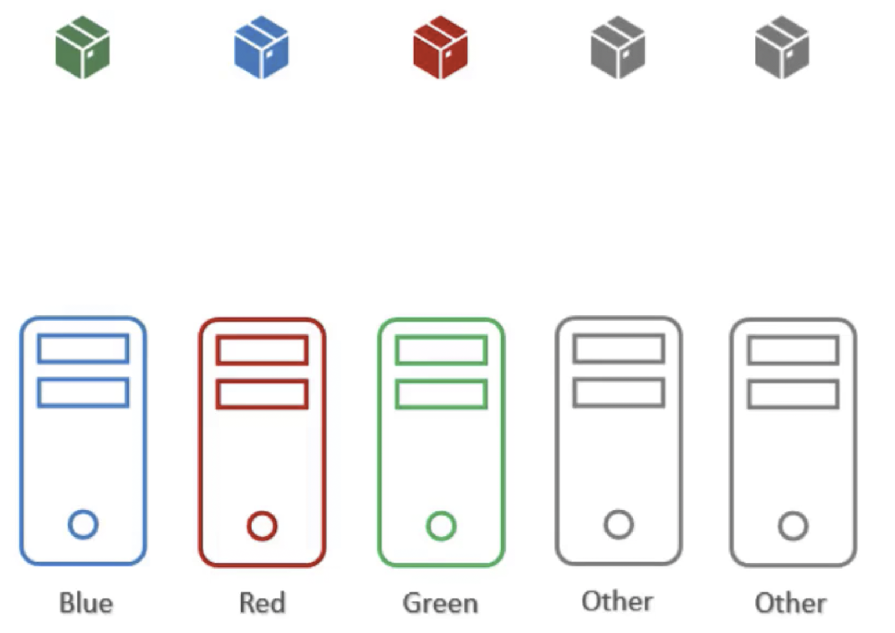

## Resource Requirements
- Scheduler decides which Node it should place the Pod in. It'll check the remaining resources of the Node. If if doesn't meet the required resources of the Pod, Scheduler will try to place on other Node. If there is not Node with sufficient resources, Scheduler will keep the Pod in Pending state.
- You can define at least 1m (1 milli) required or limit CPU for a Pod, and minimum 1Mi required or limit Memory.
- Limits and requests are in for each Pod, even if they're part of on deployment.
- You can define both required and limits, or one of them, or neither. Usually (but not always) setting Requests without Limits is the ideal config, because we let the container to get as much as resource it needs, but we make sure all other containers also will get minimum required resources.
- 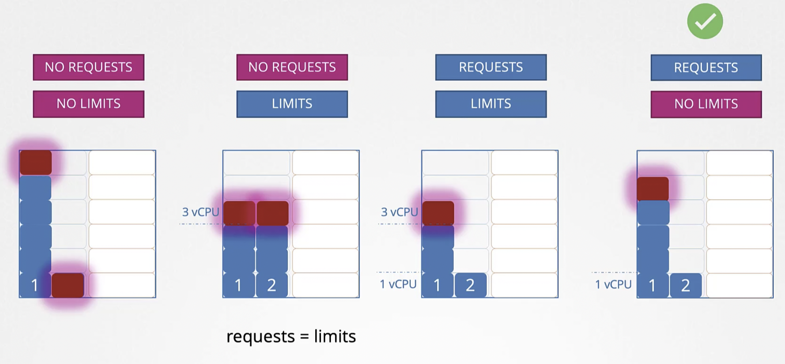
- To define required resources and/or limits:
  ```yaml
  kind: Pod
  # ...
  spec:
    containers:
      - name: my-simple-app
        image: my-simple-app
        resources:
          requests:
            memory: "100Ki" # Ki, Mi, Gi, K, M, G. or digit as byte (like 1024 )
            cpu: "1m" # 1m = 0.001 CPU
          limits:
            memory: "8Gi"
            cpu: 1        # = 1 AWS_vCPU or 1 GCP_Core or 1 Azure_Core=0 or 1 Hyperthread

  ```
- If a Pod tries to:
  - use more CPU than limits, k8s will prevent it from using
  - use more memory, k8s will kill the Pod and produce OOM (Out Of Memory) error, not prevent. We'll see 'OOMKilled' error in Pod describe, in Last State > Reason.
- By default, containers doesn't have limits and required resources. But if we want to default resource values for new Pods (not the existing ones) we can define it in **Namespace level**:
  ```yaml
  apiVersion: v1
  kind: LimitRange
  metadata:
    name: cpu-range-constraint
  spec:
    limits:
      default: # Limit
        cpu: 500m
        memory: 1Gi
      defaultRequest: # Request
        cpu: 1
        memory: 2Gi
      max: # Limit
        cpu: 4
        memory: 8Gi
      min: # Request
        cpu: 100m
        memory: 100Mi
      type: Container
  ```

  - You can define one or both of CPU and memory. 
  - To delete the default, first get list of limitRanges using `k get limitranges`, then delete the desired one using `k delete limitrange {LimitRangeNamE}`
- We can also set limits on total amount of resources used by all Pods in **Namespace** using ResourceQuotas:
  ```yaml
  apiVersion: v1
  kind: ResourceQuota
  metadata:
    name: my-resource-quota
  spec:
    hard:
      requests.cpu: 4
      requests.memory: 4Gi
      limits.cpu: 10
      limits.memory: 10Gi

# Daemon Sets
- Daemon sets is very similar to ReplicaSet, but it makes sure at exactly one replica of the Pod is deployed in all Nodes in the Cluster. Even if a Node been added after DaemonSet creation. Some usages of DaemonSet is monitoring or logging tools that we want to have in all Nodes. Even kube-proxy uses the same concept.
- How k8s does DaemonSet behind the scenes? Using labels and NodeAffinity.
- To create DaemonSet, create very similar definition to ReplicaSet:
  ```yaml
  apiVersion: apps/v1
  kind: DaemonSet
  metadata:
    name: monitoring-daemon
  spec:
    selector:
      matchLabels:
        app: monitoring-agent
    template:
      metadata:
        labels:
          app: monitoring-agent
      spec:
        containers:
          - name: monitoring-agent
            image: monitoring-agent
  ```
- Run `k create -f my-daemon-set.yaml` to create and use `k get daemonset` to list.
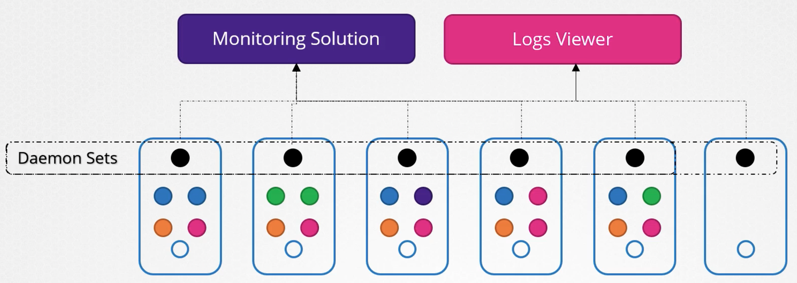

## Static Pods

- Kubelet can create/delete Pods independently, without having Kubernetes Cluster to report to. Means it can create Pods even if Master Node and its controllers like api-server, scheduler, etcd, controller-manager don't exists. How? Using pod definitions in "static pod" directory.
- Note that for running static Pods, Docker should be also installed on system, then kubelet can use it to create Pods.
- Add or remove Pod definitions to this directory, and Kubelet will take care of adding or removing these static Pods. Kubelet will even make sure the Pod is healthy, and will restart if app inside it crashes. If you modify the Pod definition, Kubelete will replace it.
- You can create Pods this way, not deployment, replicaset or services
- To define this staticPods directory, we'll jump in `kubelet.service` (using `ps -aux | grep kubelet`) file of the Node, and set path in `--pod-manifest-path`. Or create a separated config file with `staticPodPath` inside and pass its path inside `--config` of `kubelet.service`.

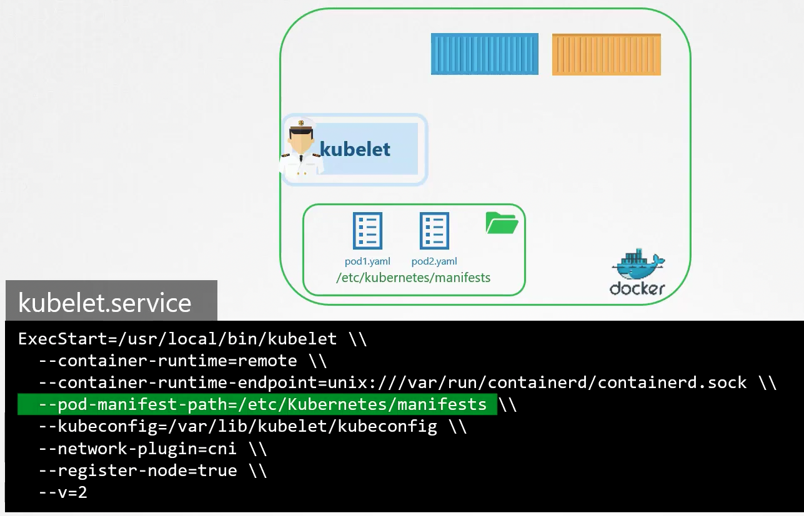

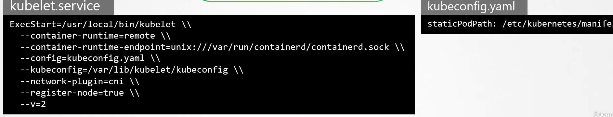

- If we don't have k8s cluster yet (just have Kubelet), we can use `docker ps` if you're running Pods on Docker. Or `crictl ps` or `nerdctl ps` if your containerisation is others like containerd
- Actually *Kubelet* can create Pods using Static Pods config, and `api-server` of Master Node at the same time. But the static Pods are Read-Only from *kube-apiserver*. We can see them using `k get pods`, but we can't modify or delete them using `kubectl`. If we delete it, Kubelet will create another one.
- In `kubectl get pods -A -o wide`, the static Pods are most likely the ones that have `-{nodeName}` suffix. Like `-controlplane`, if it's placed in *controlplane* Node. But to make 100% sure the Pod is static, get yaml of Pod using `kubectl get pod {PodName} -n {Namespace} -o yaml` and look for `ownerReferences -> kind`. If the value is `Node`, it's StaticPod, if is anything else (like `ReplicaSet`), it's not then.
- One usecase of Static Pod? Actually Kubeadm installs components of MasterNode (like apiserver, etcd, controller-manager) in this way. So, if any of these services crash, Kubelet will re-create them

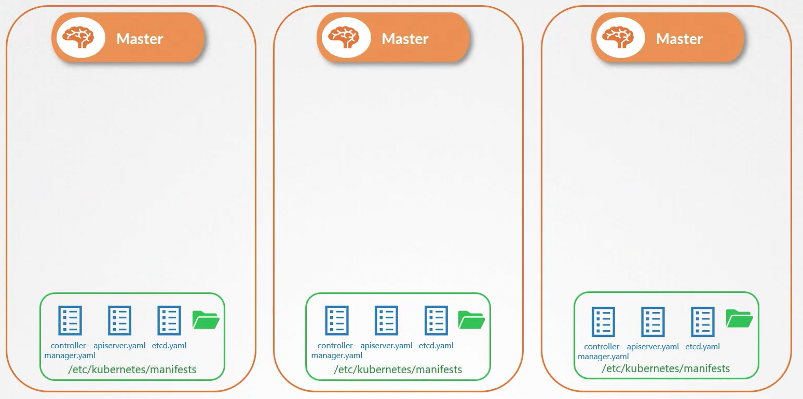

- Difference between Static Pod and DaemonSet:
  | Static PODs | DaemonSets |
  | ----------- | ---------- |
  | Created by the Kubelet | Created by Kube-API server (DaemonSet Controller) to make sure we have exactly 1 replica per Node |
  | Deploy Control Plane components as Static Pods | Deploy Monitoring Agents, Logging Agents on Nodes |
  | Ignored by the Kube-Scheduler |
- If the static pod is in another Node (not in your current connected Node), you should ssh to it first like using `ssh {nodeIP}` or `kubeclt ssh node {nodeName}`. Then look for kubelet config file.

## Multiple Schedulers
- In k8s, we can have custom schedulers. Default scheduler (`kube-scheduler`) works perfect for vast majority of workloads. However, there are times we may want to introduce additional scheduling logic or use different strategies for different workloads. In such scenarios, we can deploy multiple schedulers. Some reasons to use multiple schedulers:
  - Custom Logic. E.g some workload need more specialized constraints (like specific CPU set, large memory usage, GPU resources, time-sensitive batch processing). 
  - Advanced scheduling policies
  - Isolation and Reliability.
  - And so on
- For deploying Kube-scheduler in old fashio way, config file for scheduler would be like `my-scheduler-config.yaml` file below. And for deploying the Scheduler, after downloading the KubeScheduler binary, edit service to be like this:
  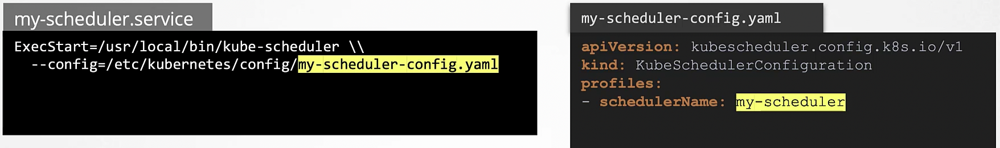
- Today, 99% of the time we do deploy scheduler as Pod, like all other kubeadm's controlplane controllers. The Pod definition will be like this:
  ```yaml
  # Pod definition file
  apiVersion: v1
  kind: Pod
  metadata:
    name: my-custom-scheduler
    namespace: kube-system
  spec:
    containers:
      - command:
        - kube-scheduler
        - --address=127.0.0.1
        - --kubeconfig=/etc/kubernetes/scheduler.conf
        - --config=/etc/kubernetes/my-scheduler-config.yaml # Path of config file

        image: k8s.gcr.io/kube-scheduler-amd64:v1.11.3
        name: kube-scheduler

  # Config file: my-scheduler-config.yaml
  apiVersion: kubescheduler.config.k8s.io/v1
  kind: Pod
  profiles:
   - schedulerName: my-scheduler
  # We enable leaderElection when we have multiple MasterNode for High Availability purpose. But because only one copy of the scheduler can be run at a time. Using leaderElection we can set which node takes the lead. 
  leaderElection:
    leaderElect: true
    resourceNamespace: kube-system
    resourceName: lock-object-my-scheduler
  ```
- See [Configure Multiple Schedulers](https://kubernetes.io/docs/tasks/extend-kubernetes/configure-multiple-schedulers/) to understand the full steps of schedulers as *Pod Deployment*.
  - Don't forget to take a look at [deployment YAML file](https://kubernetes.io/docs/tasks/extend-kubernetes/configure-multiple-schedulers/#define-a-kubernetes-deployment-for-the-scheduler) as well
- After creating the scheduler as a Pod, you can see it in Pods list.
- By default, Pods use default scheduler. But if we created custom Schedulers, we can ask Pod to use that custom scheduler with the following field:
  ```yaml
  kind: Pod
  # ...
  spec:
    containers:
      - name: nginx
        image: nginx
    schedulerName: my-custom-scheduler
  ```

  Note that the Pod will remain if *Pending* state if scheduler was not configured correctly.
- If we want to see which scheduler the Pod is using, run `kubectl get events -o wide` and see *SOURCE* column:
  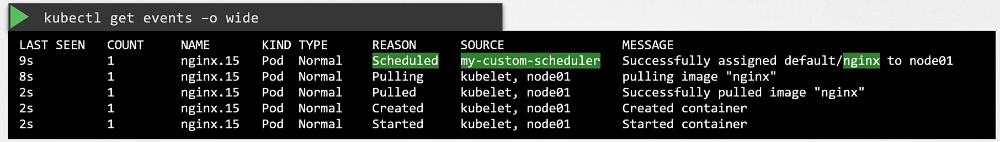
- We can also see scheduler logs if we face any issues in Scheduler, using `kubectl logs my-custom-scheduler -n=kube-system`
- Since k8s 1.18, we can have define several scheduler profiles in one definition file like this:
  ```yaml
  apiVersion: kubescheduler.config.k8s.io/v1
  kind: Pod
  profiles:
   - schedulerName: my-scheduler
   - schedulerName: my-scheduler-2
   - schedulerName: my-scheduler-3
  ```
  - Using this way, we maintain several scheduler from one file, also it prevents race condition in scheduler creation.

## Sheduler Profiles
- The following diagram shows the scheduler framework.
  - Scheduling Queue: Scheduler sort the Pods in queue (the Pods that are waiting to be created) to know which one should be processes 1st, which be 2nd so on.
  - Filtering: Scheduler filters out the Nodes that the Pods can't be deployed on (like if the Node doesn't have sufficient resources). Eg:
    - Plugin *NodeResourcesFit*: Filters out the Nodes that doesn't have sufficient resources
    - Plugin *NodeName*: Filters out Nodes that doesn't meet the *NodeName* field in Pod definition
    - Plugin *NodeUnchedulable*: Filters out the Nodes that has *Unchedulable* property set to *true*
  - Scoring: From the remanining Nodes, scheduler decides which Node it should deploy the Pod to.
    - Plugin *NodeResourcesFit*: This plugin also have job in Scoring step.
    - Plugin *ImageLocality*: Score the Nodes in higher priority if they already have the required image of the Pod container.
  - Binding: Finaly bounds the Pod to the Node.
  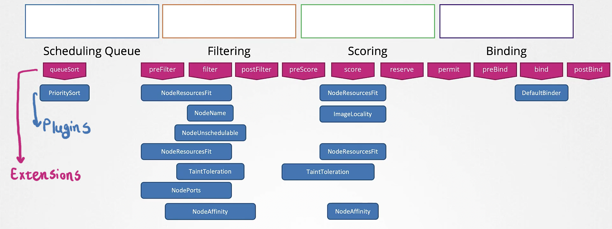
- Kubernetes does all the scheduling process using Plugins and Extensions. k8s is highly customisable. We can modify these scheduler plugins and extensions and where and how they should be placed.
- For configure plugins in schedulers:
  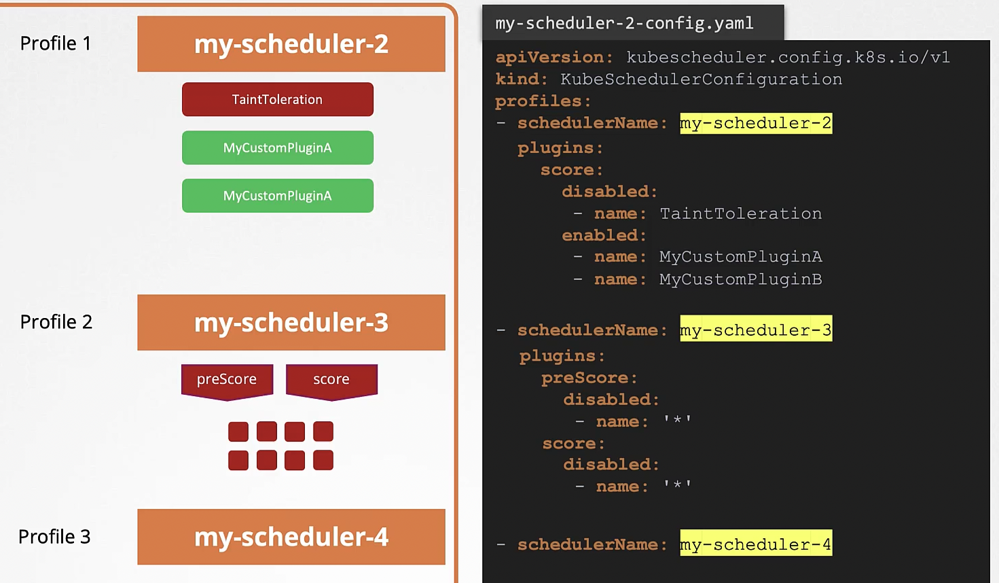

# Logging and Monitoring
## Monitoring
- There are various monitoring tools for k8s that we can install, depends on what we like to monitor (like CPU, memory, whether Node level, or Pod level, how many are healthy, so on). Some examples are METRICS SERVER, Premetheus, ElasticStack, DataDog, dynatrace.
- Let's take METRICS SERVER as our monitoring tool.
  - You can have 1 METRIC SERVER per k8s cluster
  - It stores metrics in memory, not disk. If we want to store in disk, we should use more advanced tools
  - Kubelet will have *cAdvisor* inside it which is responsible to receive metrics from Pods and send to METRICS SERVER
  - To install METRICS SERVER:
    - For *minikube* run `minikube addons enable metrics-server`
    - For all others, run `kubectl apply -f https://github.com/kubernetes-sigs/metrics-server/releases/latest/download/components.yaml`
    - After installation, the APIs may take some time to get ready.
  - After installation:
    - Use `kubectl top node` to see metrics of nodes
    - Use `kubectl top pod` to see metrics of pods

## Logging
- Very similar to how we log containers in Docker, for see logs in k8s Pod, we run the following command:
  - `kubectl logs -f {podName}` if the Pod has only one container
  - `kubectl logs -f {podName} {containerName}` . We *should* specify container name as well if we have more than 1 container in Pod

# Application Lifecycle Management
## Rolling Updates and Rollbacks
- When we create a deployment, in does rollout. Each rollout, creates a Revision (E.g Revision 1, Revision 2, so on).
- To see status of rollout of a deploy use `kubectl rollout staus deploy {deploymentName}`
- To see history of rollouts of a deploy, use `kubectl rollout history deploy {deployName}`
- There are different Deployment strategies.
  1. Recreate strrategy: All Pods gets deleted at once, and their new version gets deployed together. (k8s does this by running replicas=0 and then replicas={actualReplicsNumber}).
       - The problem with this strategy is that our application will be down between old Pods deletion and new Pods readiness time. This strategy is not the default strategy.
  2. Rolling Update: The Pods get updated to the new version 1 by 1. This strategy makes sure not all the application is down during the update. (k8s does this by creating new replicaSet inside itself, then reduces number or replicas of old replicaSet one by one, and simultaneously increase replicas of new ReplicaSet one by one).
       - This strategy is default deployment strategy

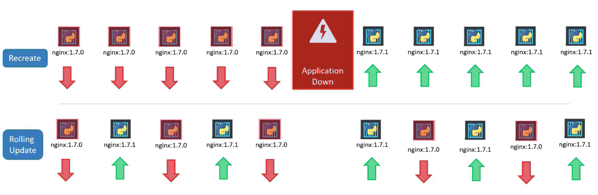

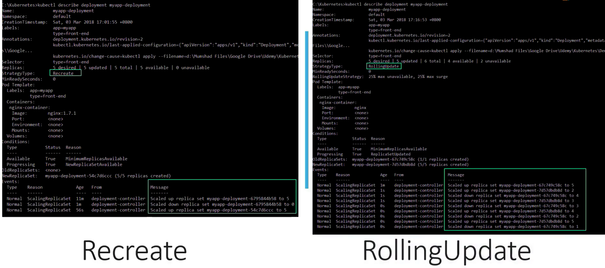

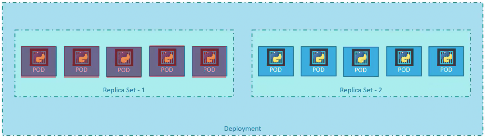

- If we only want to change the image of Pods in the Deplooyment, run `k set image deploy/{deploymentName} {containerName}={desireImageName:tag}` like `k set image deploy/my-app nginx-controller=nginx:1.9.0`
- If we want to rollback new version of our application, run `kubectl rollout undo deployment/{deploymentName}`

- To update Rollout strategy of a deployment, either use *edit* command or modify YAML def:
  ```yaml
  kind: Deployment
  # ...
  spec:
    strategy: 
      type: Recreate
  ```

  or

  ```yaml
  kind: Deployment
  #...
  spec:
    strategy:
      type: RollingUpdate
      rollingUpdate:
        maxSurge: 3
        maxUnavailable: 1
  ```

## Commands
*Note: The CKA exam won't have question from commands*
### Some notes from Docker 
- Containers are not like VMs. They stop running when their job gets done.
- Linux images file ends with `CMD ["bash"]`. And because of it, if just run a Linux image (like Ubuntu) it will get stop immediately. But for images like nginx, it's long lasting command like ` DM["nginx"]`
- Usages of CMD and ENTRYPOINT:
  - `ENTRYPOINT ["sleep"]` + `docker run myimage 5` => `sleep 5`
  - `CMD ["sleep"]` + `docker run myimage sleep` => `sleep 5`
  - ```Dockerfile
    ENTRYPOINT[ "sleep"]
    CMD ["10"]
    ```

    - In this scenario, we can either run without parameter like `docker run myimage` which will run `sleep 10` command. Or we can add the parameter that we want to override CMD, like `docker run myimage 12` which will run `sleep 12`.
    - In this config, even we really want to replace ENTRYPOINT, should use like this `docker run --enrty-point sleep2 myimage 10`
    - If we force replacing ENTRYPOINT, CMD values will be removed. For example `docker run --entry-point sleep2`, the executed command will be `sleep2` instead of `sleep2 10`
- Parametes of both ENTRYPOINT and CMD should be in one of the following formats:
  - `CMD command param1` like `CMD sleep 5`
  - `CMD ["command", "param1"]` like `CMD ["sleep", "5"]`
### Back to k8s
- In k8s Pod definition file, for overriding `ENTRYPOINT` of container we fill `command` field, for overriding `CMD`, we fill `args`:
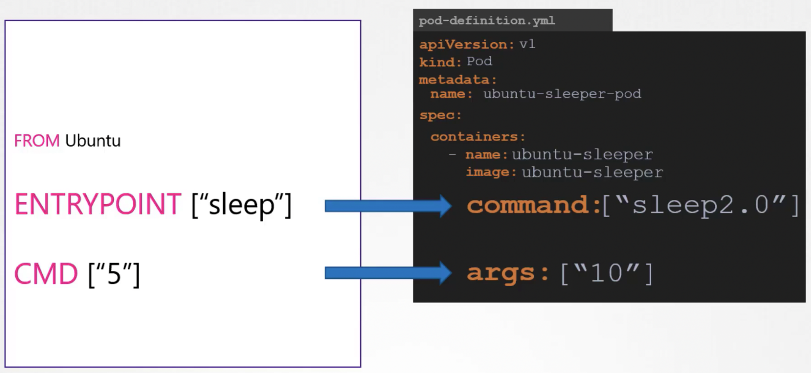
  - Values array of both `command` and `args` can be in the one of the following formats:
  ```yaml
  command: ["sleep", "1000"]
  ---
  command:
    - "sleep"
    - "1000"
  ```
- We can even pass command and args in commanline like this:
  - `kubectl run {podName} ... -- <arg1> <arg2> ...` if we want to pass `args` only.
    - E.g: `kubectl run myApp --image=my-app-image -- --color blue` 
  - `kubectl run {podName} ... command -- <cmd> <arg1> <arg2> ...` if we want to pass `command` and `args`
    - `kubectl run myApp --image=my-app-image command -- python.py myapp --color blue`

## Environment Variables
- For define environment varibles directly inside the Pod definition:
    ```yaml
    #...
    containers:
      - #...
        env:
          - name: APP_COLOR
            value: blue
    ```
- But there are other ways to define environment variables as well. ConfigMaps and Secrets.

## Config Maps
- We can seperate Pod definition from env variables using ConfigMaps.
- To create config map in imperative way:
  - `kubectl create configmap <config-name> --from-literal=key=value. E.g:
    - ```bash
      kubectl create configmap \
          appconfig --from-literal=APP_COLOR=blue \
                    --from-literal=APP_MODE=prod
      ```
  - `kubectl create configmap <config-name> --from-file=<path-to-file>` . e.g:
- To create in declerative way:
    ```yaml
    apiVersion: v1
    kind: ConfigMap
    metadata:
      name: app-config
    data:
      APP_COLOR: blue
      APP_MODE: prod
    ```
    Then run `k craete -f my-config-map.yaml`
- `kubectl get cm` and `k describe cm` also also available
- To inject the whole configMap(s):
    ```yaml
    # ...
    containers:
      - #...
        envFrom:
          - configMapRef:
              name: app-config
          - configMapRef:
              name: db-config
    ```
- To inject single env from configMap:
  ```yaml
      # ...
      containers:
        - #...
          env:
            - name: APP_COLOR
              valueFrom:
                configMapKeyRef:
                  name: app-config
                  key: APP_COLOR
  ```
- To inject the whole data as a file in volume:
    ```yaml
    volumes:
      - name: app-config-volume
        configMap:
          name: app-config
    ```

## Secrets
- Secrets are a proper k8s object to store credentials. But keep in mind that their values in Pod definition and even in ETCD are not encrypted. Also, people who have access to the namespace, can see its values. If you want to secure your secrets, maybe better to use secret management solutions in providers like AWS, GCP, or solutions like Harshicorp Vault, Helm Secrets so on.
- Secrets and their commands are very similar to configMaps, with tiny differences like base64 encoded values and can create pods using those secrets.
- The ways to add secrets:
  - The Imperative ways:
    - `kubectl create secret generic <secret-name> --from-literal=<key1>=<value1> --from-literal=<key2>...`
    - `kubectl create secret generic --from-file=<path-to-file>`
  - The Declarative way (to create with `kubectl -f create <def-file>`):
    ```yaml
    apiVersion: v1
    kind: Secret
    metadata:
      name: db-secret
    data:
      DB_HOST: bXlzcWw= # This is base64 encoded version of 'mysql'
      DB_USER: cm9vdA== # This is base64 encoded version of 'root'
      DB_PASSWORD: cGFzc3dk
    ```
    - Note that the values should be `base64` encoded.
    - To `base64` encode, run `echo -n "<myvalue>" | base64` in command line, and to decode run `echo "<myvalue>" | base64 --decode`.
- Secret values will be hidden in `k describe secrets`. If you want to see values, use `k get secret <secret-name> -o yaml`
- To inject secrets to Pod definition, we have some ways:
  - Inject the entire secret
  ```yaml
    # ...
    containers:
      - #...
        envFrom:
          - secretRef:
              name: <secret-name>
  ```
  - Inject single env value
    ```yaml
    #...
    containers:
      - #...
        env:
          - name: DB_Password
            valueFrom:
              secretKeyRef:
                name: db-secret
                key: DB_PASSWORD
    ```
  - Inject the entire secret as file in volume
    ```yaml
    # ...
    volumes:
      - name: db-secret-volume
        secret:
          secretName: db-secret
    ```
    - Note that in this way, each secret value will be stored in a separated file. For example DB_PASSWORD value will be sit in `/opt/db-secret-volumes/DB_PASSWORD` file.

### Encrypt data at rest
- If we want to encrypt data at rest (like secrets), see [Encrypting Confidential Data at Rest](https://kubernetes.io/docs/tasks/administer-cluster/encrypt-data/)

## Multi-container Pods
- Sometimes we may like to place more than one container in a Pod. Than Pod will act like a localhost for all those containers and they can easily access each other without network configuration or access to the same data storage (inside Pod) together.

## InitContainers
- If any of the containers in Pod finish its job or crashes, the whole Pod will get restarted. So, what should we do if we have a script or job that want to run **before** the actual container starts. But we don't want the whole Pod gets restarted when that side container finished its job. InitContainers is the solution.
- InitContainer and their definitions are very similar to actual containers, but they gets executed before actual containers. They should be short-running jobs not persistent. Also if we define more than one initContainers, they'll run **one at a time in sequential order**
- InitContiners should run successfully (exitCode=0), otherwise the Pod will get restarted if InitContainer fail.
```yaml
kind: Pod
# ...
spec:
  containers:
    - name: myapp-container
      image: busybox
      command: ['sh', '-c', 'echo The app is running && sleep 3600']
  initContainers:
    - name: init-service
      image: busybox
      command: ['sh', '-c', 'git clone <some-repository-that-will-be-used-by-application> ; done;']
```
- If a Pod is not READY, check `READY` column in `k get po`. If you see `Init:..` Means it's in stage or running initContainers. So, look at definition of its initContainers. If there is a problem in initContiner running, we can find it usineg `k logs {podName} -c initContainers`

# Cluster Maintenance
## OS Upgrades
- Normally, when a Pod in a Node gets down for {evictTime*} minutes (5 minutes by default), kubectl will consider it as dead. It the Pod was part of a ReplicaSet (or Deployment), it'll be recreated, otherwise it'll get ignored.
  - *evictTime is the time is the duration a Pod should be down to marked as dead by Kubectl. By default its value is 5 minutes, but we can change it using `kube-controller-manager --pod-eviction-timeout=5m0s ...`
- If we intentionally want to make a maintenance on OS (like upgrade it), all Pods should be moved to other Nodes to prevent downtime. Fo such purpose, we should run `kubectl drain {NodeName}`. This command will move all Pods to other Nodes (actually, it'll recreat them in other Nodes) and will be marked as `unschedulable` to prevent any new Pod created in it.
  - Note1: If the Node has daemonSets, drain command will fail. But we can ignore daemonSets using `kubectl drain {nodeName} --ignore-daemonsets`
  - Note2: If any of the Pods in the Node is standalone (not part of RepliaSet, ReplicationController, Job, DaemonSet or StatefulSet), the command will fail again. To ignore standalone Pods, run `kubectl drain {nodeName} --force`. That standalone Pod will get lost and won't be recreated.
- After our maintenance on Node, we can restore it to `schedulable` state by running `kubectl uncordon {nodeName}`. With this change, Node will accept new Pods (but recently moved Pods won't move back automatically)
- If we want to just change Node status to `unschedulable` without moving out the Pods, run `kubectl codron {nodeName}`.

## Kubernetes Cluster Upgrade
- Consider that k8s supports cluster versions only for 14 months, we need to take care of upgrading. But there is a note here. Because we need to upgrade the different parts of k8s seperately (to keep our server alive), we should take care of different parts' version compatibility.
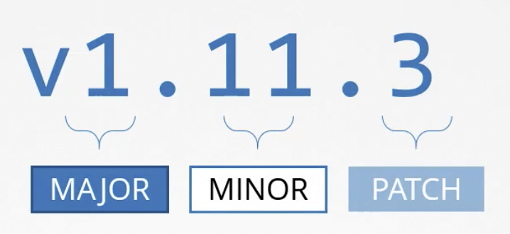
- If `api-server`'s version = `1.10.x`
  - `1.9.x` <= `Controller-manager` <= `1.10.x`. Can be `-1` minor version
  - `1.9.x` <= `kube-scheduler` <= `1.10.x` . Can be `-1` minor version
  - `1.8.x` <= `kubelet` <= `1.10.x` . Can be `-2` minor version
  - `1.8.x` <= `kube-proxy` <= `1.10.x` . Can be `-2` minor version
  - `1.9.x` <= `kubectl` <= `1.11.x` . Can be `-1` and `+1` minor version
- Use `kubeadm upgrade plan` to get version of components in cluster.
- We can upgrade to up to 1 version at a time. Means if we want to upgrade from version `1.10.15` to `1.12.3`, we should upgrade to version `1.11.x`, then to `1.12.3`.
- Upgrading k8s cluster in major cloud providers (like GCP, AWS, Azure) is very easy. `kubeadm` is also not that hard. But if we installed kubernetes manually, upgrading the cluster will be hard.
- In the upgrade process, we'll start with upgrading master node. During its upgrade, Master Node and all its components (e.g Controller-manager, kube-scheduler, so on) will be down. But, Worker Nodes will keep running Pods as they are, but there is not Master Node to manage them.
- After we upgrade Master Node, we have 3 strategies to upgrade Worker Ndoes
  1. Upgrade all Worker Nodes at once. This will make our whole app down during the upgrade. So, it's not a good strategy if we don't want our users lose access to our app
  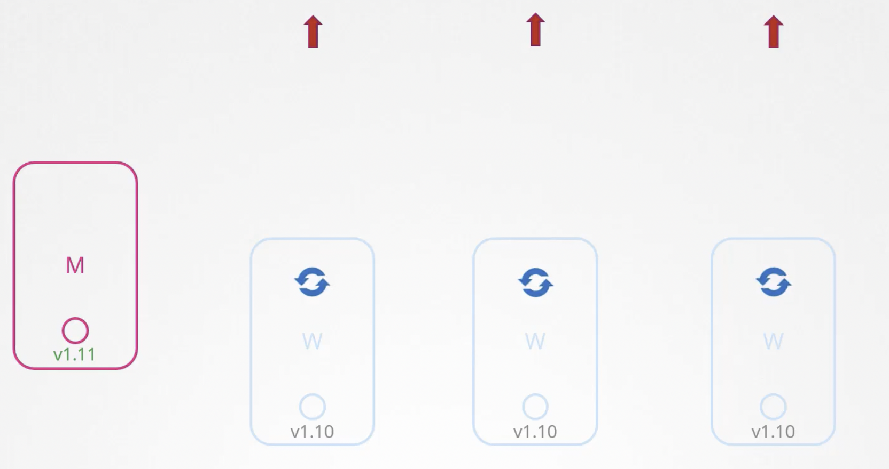
  2. Upgrade Nodes one by one. So, we'll `drain` one Node, upgrade it, then `urcordon` it.
  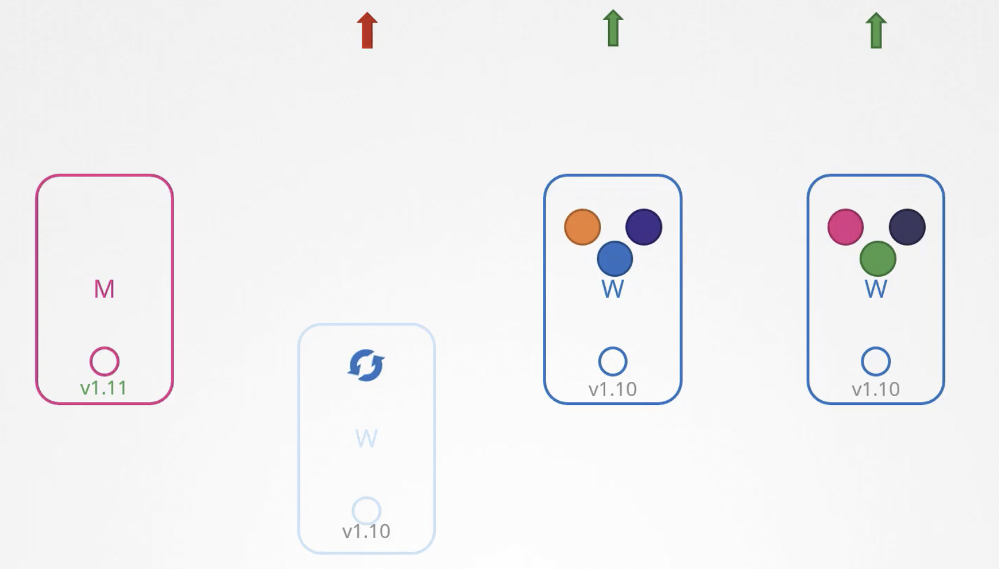
  3. Create new Node with new version before `drain`ing each Node. So, its load (Pods) will be moved to the newly created Pod
  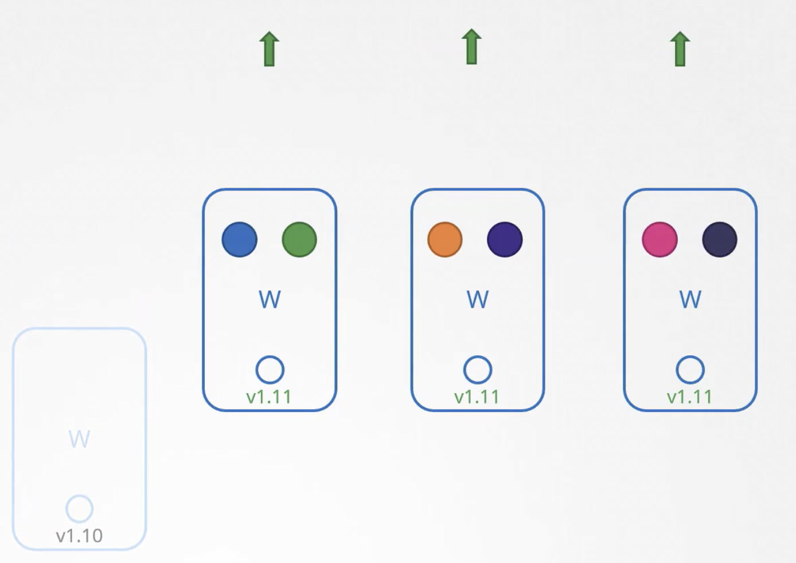
- For upgrading cluster using `kubeadm`, run `kubeadm upgrade plan`. It'll show the next command we should run for upgrade. So, after this command, for example we want to upgrade from `v1.10.0` to `v1.11.0`:
  1. Update package resouce to desired *major version* using (replace 1.28 with your desired major version) with editing file `etc/apt/sources.list.d/kubernetes.list` and make it:
    - `deb [signed-by=/etc/apt/keyrings/kubernetes-apt-keyring.gpg] https://pkgs.k8s.io/core:/stable:/v1.28/deb/ /`
  2. Then run `apt update` and `apt-cache madison kubeadm` to see available version.
  3. We should get the desired version from previous step of `kubeadm` using command like `apt upgrade -y kubeadm=1.12.0-00`
  4. Then apply it using `kubeadm upgrade apply v1.12.0` (no hyphen... appended)
  5. Note that kubeadm won't upgrade `Kubelet` in any of the Nodes. We should upgrade them manually later.The version we see in `kubectl get nodes` is the **Kubelet** version on those Nodes, not version of other components (like Controller-manager, etc). So after upgrading kubeadm and components, `VERSION` in `kubectl get nodes` will stay the same until we upgrade the `kubectl` on each of those Nodes.
    
  Now for each Worker Pod (and MasterNode if it hase kubelet):
  1. Run `kubectl drain {NodeName}` command in **Master Node**
  2. Now connect to the Node, and update `/etc/apt/sources.list.d/kubernetes.list` like how did in MasterNode
  3. Upgrade kubelet and kubectl using `apt upgrade -y kubelet=1.12.0-00 kubectl=1.12.0-00`.
  4. And restart services using `systemctl daemon-reload` and `systemctl restart kubelet`
  5. Now jump back to **Master Node** and run `kubectl undercon {nodeName}`
  6. Repeat steps 1 to 6 for remaining Nodes that have kubelet
- Full guide to upgrade: [Upgrade kubeadm clusters](https://kubernetes.io/docs/tasks/administer-cluster/kubeadm/kubeadm-upgrade/)

## Backup and Restore
- In k8s cluster, there are 3 candidates for backup:
  - Resource Configuration
    - To backup resources configurations, a good way is always have and up-to-date definition files of our resources (Pod definitions, Deploy, so on). But sometimes our different departments use imperative commands to create & update resources (not using definition file). In such situation that our definition files does not reflect the actual resources on k8s cluster, we may use:
      - Run `kubectl get all --all-namespaces -o yaml > all-deploy-services.yaml` to extract config of our resources. But it won't export all resource groups, so better to use the next solution
      - Use k8s backup tools like *VELERO*.
  - ETCD Cluster 
    - ETCD Cluster stores information about state of our cluster (like Nodes, so on), It's hosted on in MasterNode(s). While configuring ETCD, we configured data folder in `etcd.service` (e.g `--date-dir=/var/lib/etcd`).
    - To backup ETCD Cluster:
      - We set a backup tool to backup ETCD data directory (that we can find in etcd.service)
      - Also ETCD comes with built-in snapshot solution.
        - First set ETCTCTL api version using: `export ETCDCTL_API=3` 
        - To do backup, run `etcdctl snapshot save my_snapshot.db`
        - To view status of snapshot `ectdctl snapshot status my_snapshot.db -w table`
        - To restore the backup (if we installed k8s manually)
          - Firstly, stop *kube-api-server* using `service kube-apiserver stop` (because ETCD restore will restart ETCD cluster, which is required by *kube-api-server*)
          - Run `etcdctl snapshot restore my_snapshot.db --data-dir /var/lib/etcd-from-backup`. This will configure *new cluster* to prevent joining new members to the old cluster
          - Modify `etcd.service` to use new etcd data directory by modifing to like `--data-dir=/var/lib/etcd-from-backup`
          - Reload daemon with `systemctl daemon-reload` and restart service with `service etcd restart`
          - Re-run kube-api-server using `service kube-api-server start`
        - To restore backup (if we installed k8s using kubeadm)
          - Run `etcd snapshot restore my_snapshot.db --data-dir /var/lib/my-etcd-from-backup`.
          - Since *kubeadm* installs ETCD as a static Pod (Check *static pod* section if you curious how to distinguish static pod), we should modify data-dir in static Pod.
          - Find ETCD static Pod definition (find static pod manifests folder using `ps -aux | grep kubectl`)
          - Consider that `--data-dir` in ETCD Pod definition file is inside the container, it's mounted to a directory in host file. So, find the the related hostPath in volumes section and modify that, instead of directly --data-dir in container section.
          - After making changes, k8s will restart the Pod. It may take minutes.
          - If the Pod remains on Pending state for a long time, delete it `k delete po -n kube-system {etcdContainerName}`
    - Note: In all `etcdctl` commands, don't forget to set endpoint, cacert, cert and key if our ETCD is using TLS (can identify from describe)
       ```bash
       export ETCDCTL_API=3;
       etcdctl snapshot save my-snapshot.db \
              --key={keyFile} ## Can find it in '--key-file' in ETCD Pod describe or etcd.service
              --cert={certFile} ## Can find in '--cert-file'
              --cacert={caCertFile} ## Can find in '--trusted-ca-file'
              --endpoints={endPoint} ## Can find it in '--advertise-client-urls (for access from outside) or --listen-client-urls (for access from inside)'
       ```
    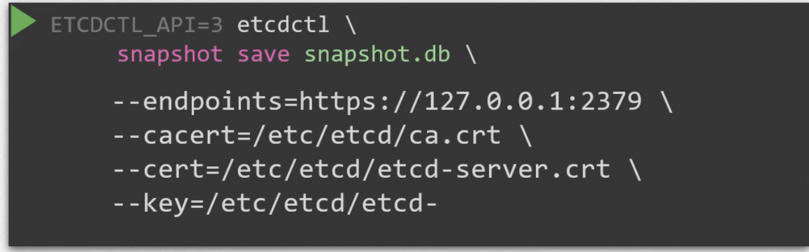
  - Persistent Volumes (if we have any)

# Security
## Basics
- Security in k8s is important. E.g security the server, etc. But securing `kube-apiserver` is one of the most important ones because its the gateway between k8s components and world outside.
- When security of `kube-apiserver` comes in, there are 2 questions:
  - [**Authentication**] Who can access? We can achieve this using:
    - Files that holds username and passwords
    - Files that holds username and tokens
    - Certificates
    - External Authentication provider - LDAP
    - Service Accounts
  - [**Authorization**] What they can do? We can achieve this using:
    - RBAC Authorization
    - ABAC Authorization
    - Node Authorization
    - Webhook Mode
- All communication between k8s components (like betwen apiserver and etcd) are secured by TLS
- By default all Pods can access to each other. But we can control these communication between applications and Pods using **Network Policies**

## Authentication
- We can have authentication mechanism for Admins (using kubectl), Developers (using curl api-server) and Bots to access to our k8s.
- For bots, we can do it using `kubectl create serviceaccount {serviceAccountName}`. But for admins and developers, we need other solutions like storing username passwords in a file.
- api-server authenticates the user before processing request:
  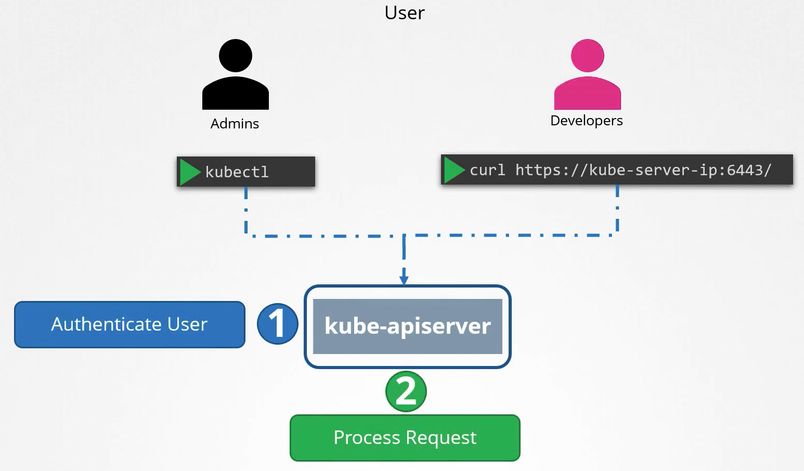
- For defining auth user&pass using a file, we create a CSV file with 3 column: password,username,userId,group (group column is optional) like this:
    ```
    password1,user1,u001,group1
    password2,user2,u002,group1
    password3,user3,u003,group2
    ```
    - Then we pass the path of that file in kube-apiserver.service if we installed k8s manually, or api-server's Pod definition if we installed using kubeadm:
    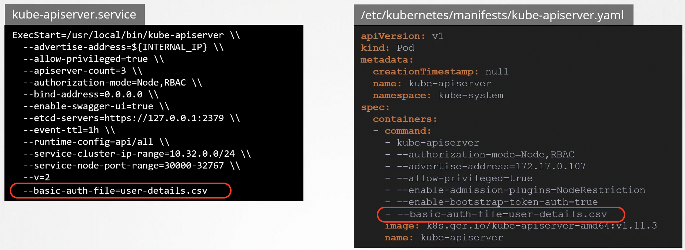
    - Now for connecting to this apiserver, specify username&pass like this:
    

- For defining auth using user&token file, create similar CSV file, but first column should be token:
  - ```csv
    eyJhbGciOiJIUzI1NiIsInR5cCI6IkpXVCJ9,user1,u001,group1
    ```
  - Then pass it in kube-apiserver config with `--token-auth-file` key.
  - For connecting to this apiserver, use:
  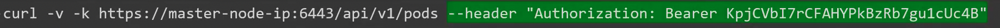
- Note: Basic authentication (either user&pass or user&token) is not a secure and recommended. It's deprecated in v1.19.

## TLS & Certificates
- There are 3 types of certificates in the lifecycle of our app or sevice:
  - CA certificate: CA uses this to sign the certificates.
  - Server certificate: Server uses this to decrypt data received from client
  - Client certificate: Client uses this to decrypt data received from server
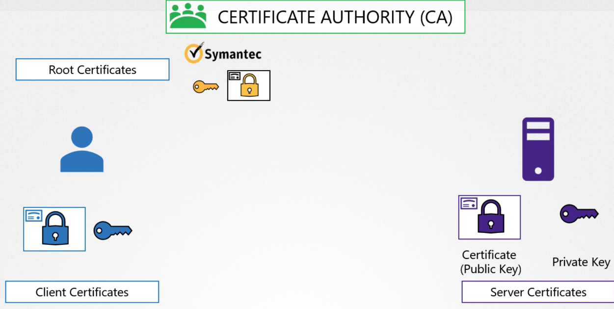
- Communication between all k8s components need to be secured using TLS.
- What components in k8s will have "Server Certificate"?
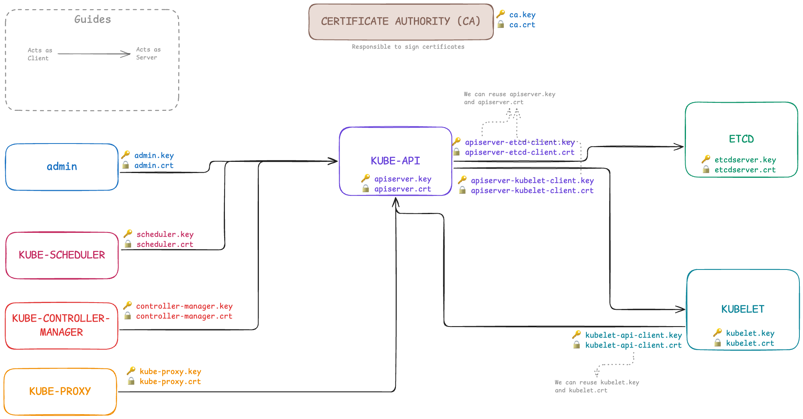

- There are different tools to generate certificates. We use OPENSSL
- We should have internal CA to sign certificates. It can be one CA for signing all components. But if we have a ETCD cluster for high availability purpose, we can also have a dedicated CA for signing ETCD related certificates (either server or client).
- All components should have:
  - Its certificate file signed by CA
  - Its key file
  - A copy of ca.crt file of CA
- First of all, we should have a Certificate Authority (CA). This will be our internal CA to sign all the certificates. To generate certificates for it:
  - Run `openssl genrsa -out ca.key 2048` to generate key file.
  - Run `openssl req -new -key ca.key -subj "/CN=KUBERNETES-CA" -out ca.csr` to generate *certificate signing request*
    - Certificate Signing Request (CSR) is like a certificate with all your details, but without signature
    - `/CN` stands for Common Name.
  - Run `openssl x509 -req -in ca.csr -signkey ca.key -out ca.crt`
    - Acually, signing a CSR should be done by CA, so -signkey should be CA's key. But in CA creation step, we'll sign it by its own key.
- To generate certificate for ADMIN:
  - Run `openssl genrsa -out admin.key 2048`
  - Run `openssl req -new -key admin.key -subj "/CN=kube-admin/O=system:masters" -out admin.csr`.
    - Note that `/CR` value can be anything. But provide a relevant one, because kube controller authenticate with it, and it shows everywhere in logs, etc
    - `/O` is users groups. Because we want to differentiate admin users from other users, we should pass this in certificate.
  - Run `openssl x509 -req in admin.csr -signkey ca.key -out admin.crt`
  - An example on how to send request to apiserver with admin user**
    - `curl https://kube-apiserver:6443/api/v1/pods --key admin.key --cert admin.crt --cacert ca.crt`
    - But instead of defining certificates in the command everytime, we can also define them in kube-config.yaml like this:
      - ```yaml
        apiVersion: v1
        kind: Config
        clusters:
          - cluster:
              certificate-authority: ca.crt
              server: https://kube-apiserver:6443
            name: kubernetes
        users:
          - name: kubernetes-admin
            user:
              client-certificate: admin.crt
              client-key: admin.key
        ```
- To all other clients, the process will be similar, only the `/CN` will be different:
  - For *KUBE SCHEDULER*, it should start with *system* because it's a system component: `system:kube-scheduler`
  - For *KUBE CONTROLLER MANAGER* : `system:kube-controller-manager`
  - For *KUBE PROXY*: `system:kube-proxy`
- Now, let's generate certificate for components that act as server. First, *ETCD*:
  - All steps are similar to previous. `/CN=etcd-server`.
  - If our ETCD is deployed as a cluster across multiple servers for HA purpose, to secure connection between members of the cluster, we should also create *peer* certificate for each.
    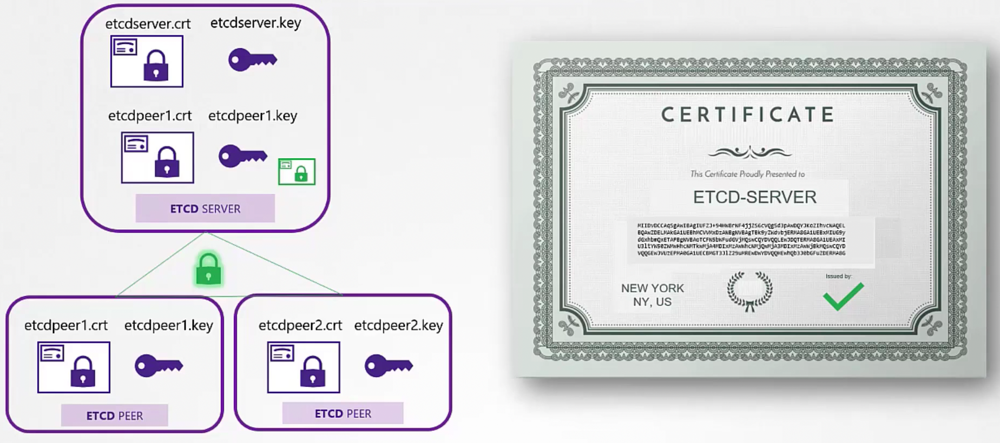
    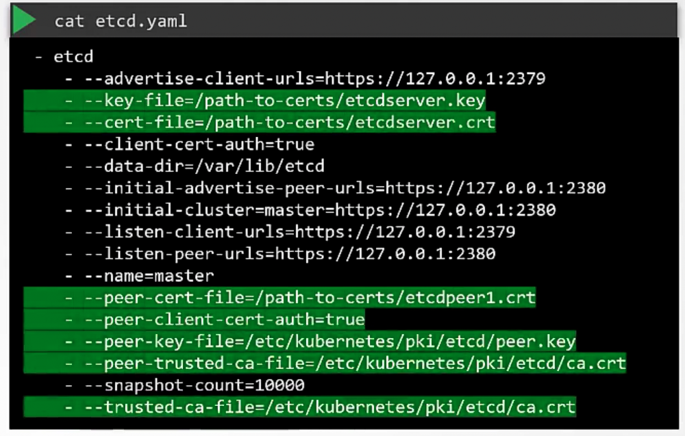
- For *KUBE API SERVER*, because different services and different people may know it by different names, we should add the following names addtional to the name we choose (like `KUBE-API-SERVER`) in the license: `kubernetes`, `kubernetes.default`, `kubernetes.default.svc` and `kubernetes.default.svc.cluster.local` and `<IpAddressesOfServerBehindApiServer>`. To create such certificate request (csr):
  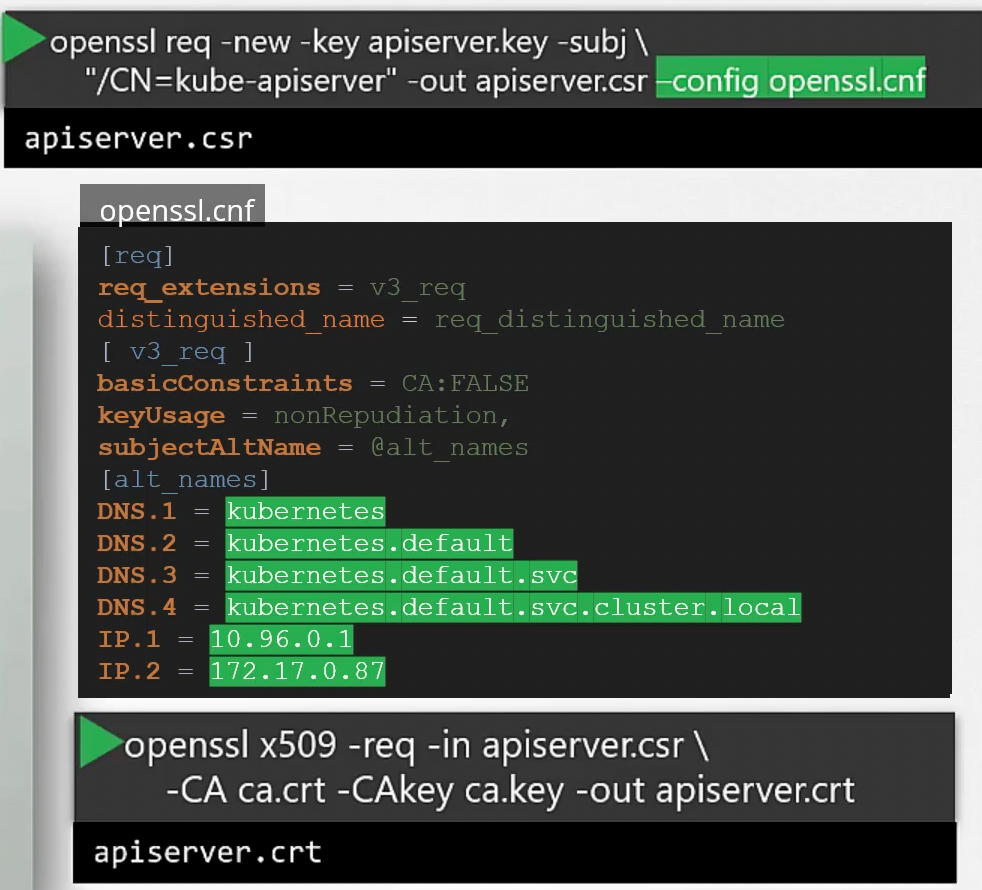
  - Then pass these generated certificates, and client certificates for communicating with ETCD and kubelet:
  - 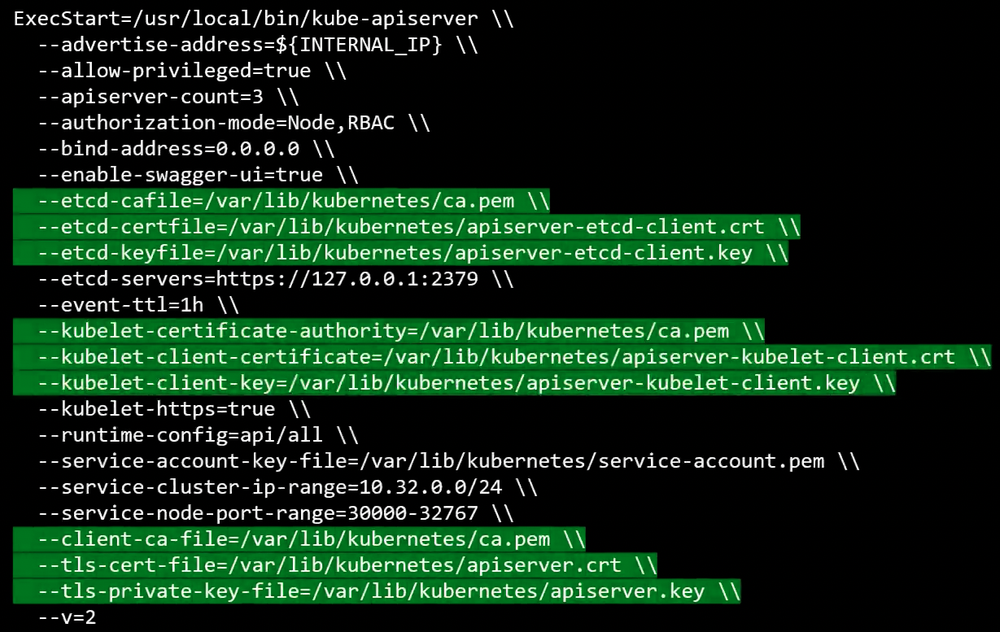
- For *KUBELET* nodes (to act as server), the steps are similar, but ther /CN should be node01, node02, so on. Once the certificates are created, use them on `kubelet-config.yaml` for each node in the cluster:
  - 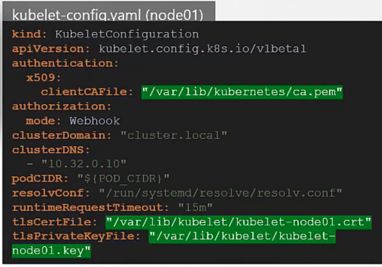
- But we should also create client certificate for Nodes (to act as client agains apiserver). But because apiserver should verify these nodes and their access levels, their /CN should be like `system:node:node01`, `system:node:node02` and so on. And should have group (`/O`) `SYSTEM:NODES`

- To view certificates of each component:
  - First find the path the cerificate. E.g. For api-server it locates in `/etc/systemd/system/kube-appiserver.service` if you insatlled k8s manually, and locates in `/etc/kubernetes/manifests/kube-apiserver.yaml` (static pods definition location)
  - Now, to see information of certificate file, run `openssl x509 -in <path-to-crt> -text -noout`. Verify the fields `Issuer`, `Not After`, `Subject`, `Alternate Name` fields very carefully. For example, *Issuer* should be *kubernetes* not something like *self*, or Expiration fields shouldn't be passed. Something like image below:
    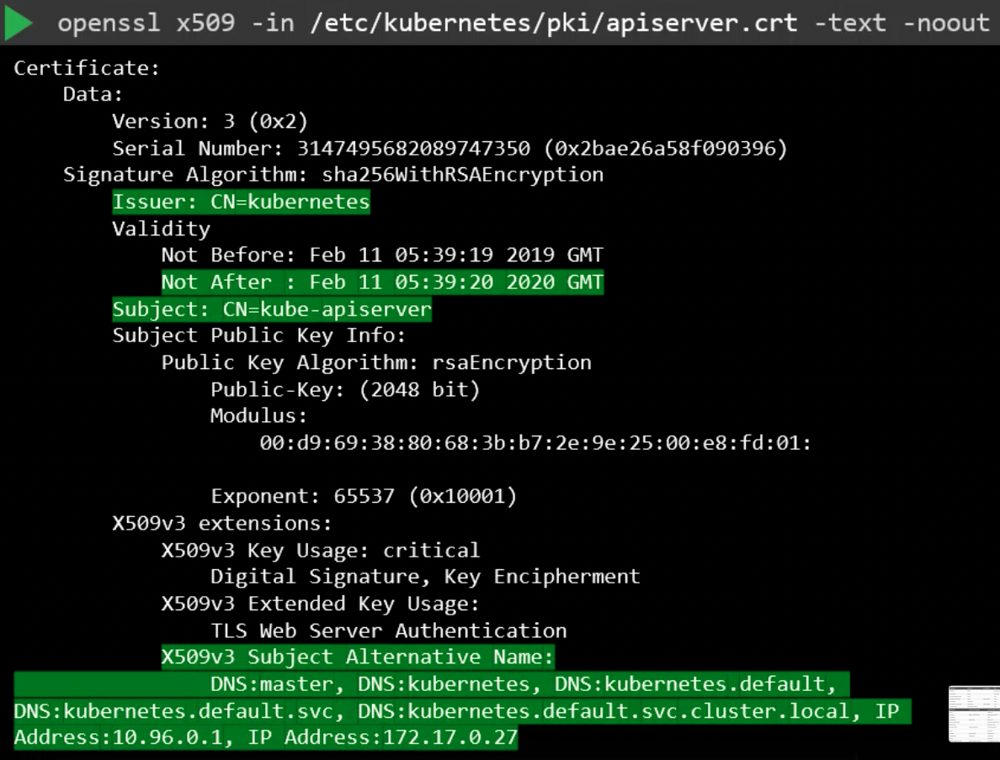
- If ETCD has its own CA (separated from the CA for other components), *api-server* we should pass ETCD's CA on `--etcd-cafile` paremeter instead of main CA.
- If you ran any issues with certificates (for example for etcd component), checkout the logs. If you installed k8s manually, check `journalctl -u <componentName>.service -l` or if you installed using kubeadm, run `kubectl logs <etcd-pod-name>`. In a case kube *kubectl* command have issue, you can see log directly from Docker using `docker logs <contrainerId>` (find containerId by running `docker ps -a`):
  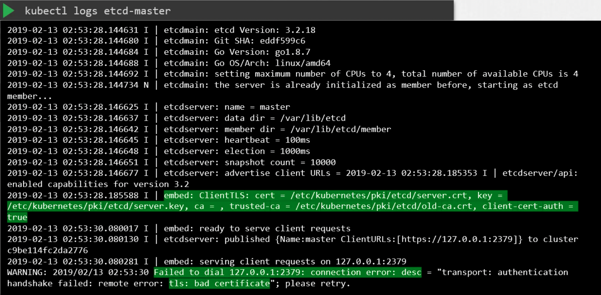
- If in `kube-apiserver` logs we see an error related to `:2379` (or another port if we're not using default port for ETCD), think about ETCD. You may need to jump in logs of ETCD to find the issue.
- In the following error, we see TLS verification failure. It means most likely crt is not signed at all, or signed by different CA than ETCD's CA:
  `addrConn.createTransport failed to connect to {Addr: "127.0.0.1:2379", ServerName: "127.0.0.1:2379", }. Err: connection error: desc = "transport: authentication handshake failed: tls: failed to verify certificate: x509: certificate signed by unknown authority"`

### Sign Certificates using Kubectl
- Any user that want to have access to the kube-apiserver need to use a certificate. The user should give his `csr` (Certificate Sign Request) to admin, and admin sign it using CA or kubernetes. But because signing the CSRs need `.key` file of CA, and key file should be kept only in the kubernetes server (for keeping secure), the signing process will be time challenging for the admin. Kubectl has a built-in command for signing CSRs. This is the process:
  - The user creates key using `openssl genrsa -out <username>.key 2048`
  - Then he creates a CSR using `openssl -new -key <username>.key -subj "/CN=<username>" -out <username>.csr`
  - He shares the CSR with admin. Admin encode CSR to base64: `cat <username>.csr | base64 -w 0`, because csr in definition file should be encoded
  - Create definition file:
    - ```yaml
      apiVersion: certificates.k8s.io/v1
      kind: CertificationSigningRequest
      metadata:
        name: <csrName>
      spec:
        expirationSeconds: 600 # Seconds
        usages:
          # The followings are just examples
          - digital signature
          - key encipherment
          - client auth
        request:
          <encodedCsr>
      ```
  - Create the object using `kubectl create -f <username>_def.yaml`
  - Admin can see list of CSRs using `kubectl get csr` and approve any of the using `kubectl certificate approve <csrName>`
  - Now, after approving the CSR, run `kubectl get csr <csrName> -o yaml` and copy value inside **Status** > **Certificate** and decode it using `echo "<certValue>" | base64 --decode`.
  - This decoded value is certificate. Share it with the user
- This certificate signing is done by *CSR-APPROVING* and *CSR-SIGNIING* controllers inside *Controller Manager*. So, Controller Manager should have CA key and cert configured:
  - 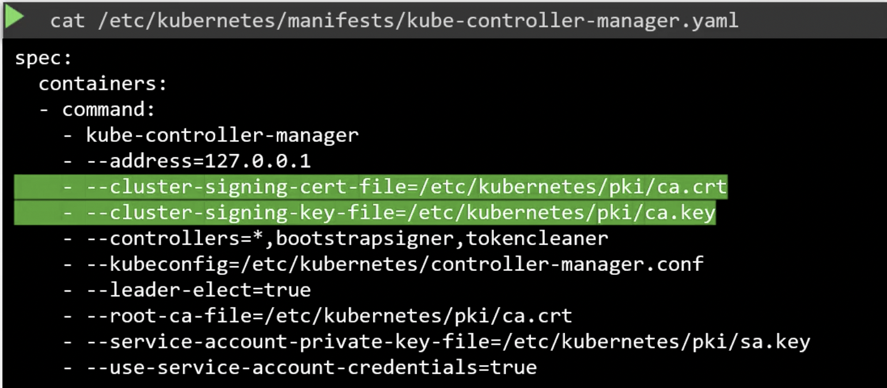
    
## Config file
- Actaully, for any call to apiserver, admin or user need to define certificate, key, CA and server (either curl command or kubectl) like:
  - ```bash
    kubectl get pods \
        --server my-kube-playgroud:6443 \
        --client-key <path-to-key> \
        --client-certificate <path-to-cert> \
        --certificate-authority <path-to-ca-cert>
    ```
  or
  - ```bash
    curl http://my-kube-playground:6443/api/v1/pods -key <path-to-key> -cert <path-to-cert> -cacert <path-to-ca-cert>
    ```
- But there is a better solution, using **Config** file. By defining clusters, users and contexts in this file, we don't need to pass certificates in commmand anymore.
- Config file should have 3 parts:
  - Clusters
  - Users: Note that, we're just using already created user, not creating a user.
  - Contexts: To define which user connects to which cluster. Context can be many to many connection between cluster and user. Means we can define cluster for a specific user and vice versa.
  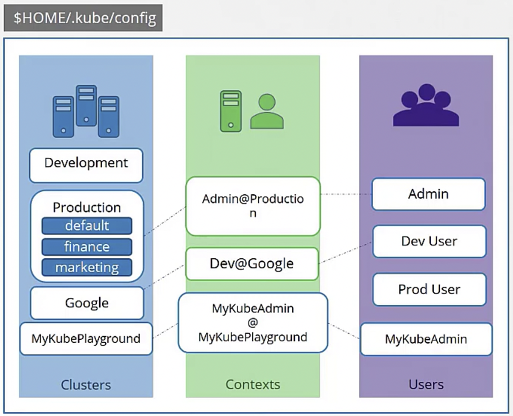
  - Now, you can run your commands using the config file like `kubectl get pods --kubeconfig <path-to-config>`. But if your config file path be `$HOME/.kube/config` path, you don't need to pass --kubeconfig and just run `kubectl get pods`. You see? kubeadm and minikube created this file for us. That's the reason we don't need to define any certificate in `kubectl get pods` command.
```yaml
apiVersion: v1
kind: Config
# 'current-context' is optional. By defining this field, we tell k8s to use this by default.
# When we use `kubectl config use-contex <contextName>`, k8s updates this value inside the config file
current-context: finance@production
clusters:
  - name: my-kube-playground
    cluster:
      certificate-authority: ca.crt
      server: https://my-kube-playground:6443
  - name: google
    cluster:
      server: # ...
      # We can define the actual certificate (but base64 encoded version) instead of passing file path.
      certificate-authority-data: LS0tLS1CRUdJTiBDRVJUSUZJQ0FURS0tLS0tCk1JSURCakNDQWU2Z0F3SUJBZ0lCQVRBTkJna3Foa2lHOXcwQkFRc0ZBREFWTVJNd0VRWURWUVFERXdwdGFXNXAKYTNWaVpVTkJNQjRYRFRJMU1ERXdNekU1TVRJME5sb1hEVE0xTURFd01qRTVNVEkwTmxvd0ZURVRNQkVHQTFVRQpBeE1LYldsdWFXdDFZbVZEUVRDQ0FTSXdEUVlKS29aSWh2Y05BUUVCQlFBRGdnRVBBRENDQVFvQ2dnRUJBTFlqCnh3aFh1TEkvbElNakdWK3hocGFjU3YwUVNWbVV1c1dYMUVNNWd5bWZNRGtQQzFQNnNYOFpzTVcrem0vMC9pb0cKcVhuOFp6VytRQ3JxSXd6ek1HOXNkRi9JWUpvd2FOaklDeVNZY0k3YTBqdGJMNlQzMzh0N2lmUXh3TGRKNVRtOApqKzhwM25rckxtQ1NyTUNSaURCdnYxWVppMW9iM3g3dDYxYitBUVB4dG9QdzRMOEQ3dmxCMC9uYXdWRDlzS1ZqCmkxN09JWW1xTkZ4YVN4L1BsbFdHV2hOOWFVMnBFaDUvRm1SQnlYVUVqb0pvQTFyWVprSDU5RFI4aW1XREtjRXEKZWY3a1FmTXBKN1UxeEllNUNqM3gyekJuR3F2VHdrTGtXdmU1UVFtRm9BV0JSVmp1VTMrcytNdmZHcE5wN0hjdwo2VlZpdjRBNE93d1NBK0l1S0xVQ0F3RUFBYU5oTUY4d0RnWURWUjBQQVFIL0JBUURBZ0trTUIwR0ExVWRKUVFXCk1CUUdDQ3NHQVFVRkJ3TUNCZ2dyQmdFRkJRY0RBVEFQQmdOVkhSTUJBZjhFQlRBREFRSC9NQjBHQTFVZERnUVcKQkJSR2pPdTduQnJoYmJWaWlVMXhtTG9leE1KSWFqQU5CZ2txaGtpRzl3MEJBUXNGQUFPQ0FRRUFRYzYrSlloMwpNY2FuemFhVG1rajRZQ2pBbGN1TndoTFV1aFhsWU5CRnB6Q0owajZhNHB5RmdON29JcVp4YVBCUStITGpCaEt1Cks5ZGcrVXZ6ZDdmZkM4blNnbFV5RU5TMDJlSjU1cVEzOEN4UDltcnZ5U2N4K3UvczByME1GU2h5V0ROTzJZME8KN0tNbGxMUmZTVW9GVktVREJmZTV5UjVsTW0wZXYwZDI5ZUFBU0ZmTmxRUkdpTDVERUFUWkpXckdhaDNOdlRTQQorNXg0RnNXRC95NU0wZVlXSE1BdUZEQWRsaEhxdDA4V1NLVDk0ZXdPa3Fzb1dnckNxYUZ6dndXWXo0YVhSaldWCmdZTG5QTDNidXhTaWw2N2V6SGlCQjMvblp1Q3o0eXhnazllTXQvdUV5WjdqeUJNdEtTSGc0NFVRdFJpbE1ncVIKUUIrYkRHdURWOHlTUXc9PQotLS0tLUVORCBDRVJUSUZJQ0FURS0tLS0tCg==
  - name: dev # ...
  - name: production # ...
contexts:
  - name: my-kube-admin@my-kube-playground
    context:
      cluster: my-kube-playground
      user: my-kube-admin
  - name: admin@production
    context:
      cluster: production
      user: admin
      ## namespace field is optional. It means when we switch to this context, namespace also will be set
      namespace: finance
users:
  - name: my-kube-admin
    user:
      client-certificate: admin.crt
      client-key: admin.key
  - name: dev-user
    user: #...
  - name: prod-user # ...
  - name: admin # ....
```
- Note that we don't need to any object using this definition file, just we need to use it in our kubectl or http calls of kubernetes.
- To view the using config file, we can use command line as well `kubectl view config`
- To change the context (which will automatically update config file as well), can run command `kubectl config use-context <contextNama>`
- Using command line, we can even change other things of config. See `kubectl config -h`
- Instead of passing CA certificate file (and even for other certificates) in config file, we can pass the actual certificate itself (but encoded version using base64) like.
- If we faced an error similar to `error: unable to read client-cert ...` in any **kubectl** command (like `kubectl get pods`), the problem is in TLS of user in our config. Check that.

## API Groups
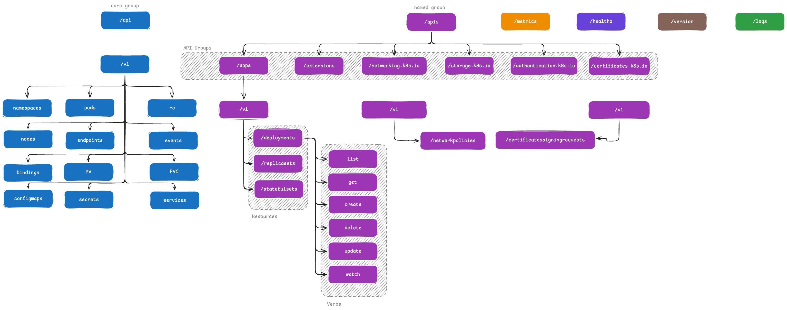
- (Don't need to remember diagram. Just understand it)
- Most of the new and future API groups in k8s goes to **Named** group.
- Knowing API groups will help us in giving permissions to k8s users.
- To see available api groups run `curl https://<kubernetesServer>:<kubernetesPort> -k --key <clientKey> --cert <clientCert> --cacert <caCert>`, and to see named api groups run `curl https://<kubernetesServer>:<kubernetesPort>/apis -k  ...| grep "name"`
  - If we don't define certificates or if our certificates has not enough permission, we'll receive 'Forbidden'. 
- Normally, each time we want to run curl to our kube apiserver, we should define certificates. But another way is to run `kubectl proxy`. This will start a proxy on port `8001` and forwards every request to our kube apiserver and will also assign certificates based on config file.
  - After enabling proxy, our curls will be like this: `curl https://localhost:8001 -k`
  - Don't confuse between **kube proxy** and **kubectl proxy**.

## Authorization
- We use authorization to limit access levels of developers or bots to the specific resources or api groups.
- Some authZ methods that k8s supports:
  - Node
    - When each kubelet wants to Get information about Services, Endpoints, Nodes and Pods from Kube API server, or write information like Nodes status, Pod Status, Events to Kube API server. These privileges gets checked by *Node Authorizer*. Remember the `SYSTEM:NODES` we've as group to kubelets when creating certificates.
  - ABAC
    - Because we need to restart Kube api server after each change ABAC, and because we need to add new Policy for each user separately, it's difficult to manage compared to ABAC.
    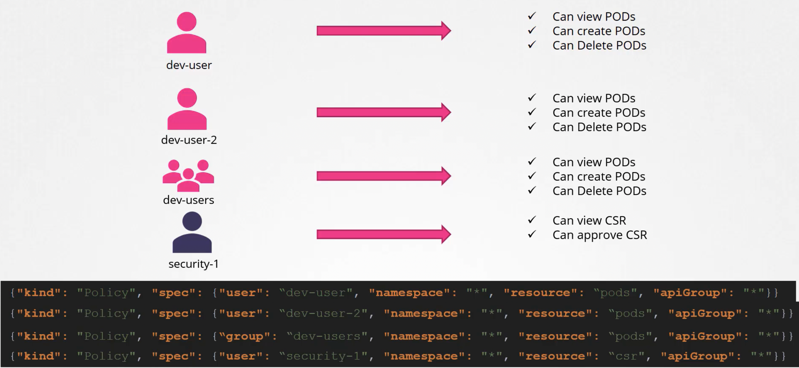
  - RBAC
    - It's easier than ABAC, because we create specific roles with permisions. Then add as many users as we want to that role.
    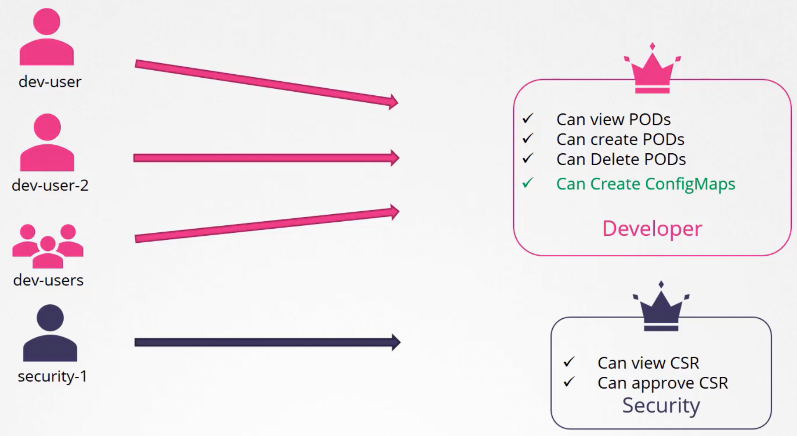
  - Webhook
    - We delegate user authorization to a 3rd party, like *Open Policy Agent*. KubeAPI will ask that service to whether grant access to the user or not.
  - Always Allow
    - Allows all requests without authZ checks
  - Always Deny
    - Denies all requests
- We define authZ method(s) in `--authorization-mode=` in KubeAPI server config. It can be more than 1 method with comma separated. When you have multiple methoed configured, KUBE API will use each method in sequence to authorize the request, if the method denied the request, it'll jump to the next method in defined list, until reach the end.

### RBAC
- Role bases access, grants permission in namespace scope. It won't affect the whole cluster.
- First we craete (`k create -f <defFile.yaml>`) a Role using definition file:
  ```yaml
  apiVersion: rbac.authorization.k8s.io/v1
  kind: Role
  metadata:
    name: developer
  rules:
      # If you're not sure about apiGroups and resources values, run `k api-resources --namespaced=true`. Use 'NAME' column as resource, and use 'APIVERSION' without 'v1' suffix as apiGroups.
    - apiGroups: ["apps"]
      resources: ["deployments"]
      verbs: ["create"]
    - apiGroups: [""] # if want to grant ANY api groups, pass "*"
      resources: ["pods"] # if want to grant ANY resource, pass "*"
      verbs: ["list", "get", "create", "update", "delete"] # if want to grant ANY verbs, pass '["*"]'
      # resourceName field is optional. With this field, we limit the privilege to specific resources (E.g only Pods with name 'blue' and 'green', )
      resourceNames: ["blue", "green"]
  ```
- Next we create a RoleBinding to bind user to the Role
  ```yaml
  apiVersion: rbac.authorization.k8s.io/v1
  kind: RoleBinding
  metadata:
    name: johndoe-developer-binding
  # subject is the "thing" we want to add to this role. It can be "User" or "Group", so on.
  subjects:
    - kind: User
      name: johndoe
      apiGroup: rbac.authorization.k8s.io
  roleRef:
    kind: Role
    name: developer
    apiGroup: rbac.authorization.k8s.io
  ```
- Note: Role and RoleBindings fall under namespaces scope. If you want to create role or rolebinding for another namespace, define the namespace in `metadata`.
- We can also create either Role and Rolebinding using imperative commands. Run `k create role -h` to get information. Or even create definition using --dry-run.
- Run `kubectl get roles` to get roles and `kubectl describe role <roleName>` to get its information
- Run `kubectl get rolebindings` to get roleBindings and `kubectl describe rolebinding <roleBindingName>` to get its info.
- If you (as user) want to check whether you have to access to perform a action in a cluster, run command like `kubectl auth can-i create pod`.
  - If you're admin and want to check a user's access, run `kubectl auth can-i create pod --as johndoe`
  - In both of the commands above, you can add `--namespace <NSName>` to check permission in specific Node
  - If you want to perform a action as a user, add --as, like `kubectl get po --as johndoe`

**Cluster Roles**
- If we want to grant privilege in cluster level (**either to namespace scope resources like Pods or cluster scoped resources like Nodes**), we should use cluster roles. 
- First we should create Cluster Role using such def file:
  ```yaml
  apiVersion: rbac.authorization.k8s.io/v1
  kind: ClusterRole
  metadata:
    name: cluster-administrator
  rules:
      # If you're not sure about apiGroups and resources values, run `k api-resources --namespaced=false`. Use 'NAME' column as resource, and use 'APIVERSION' without 'v1' suffix as apiGroups.
    - apiGroups: [""]
      resources: ["nodes"]
      verbs: ["list", "get", "create", "delete"]
    - apiGroups: [""]
      resources: ["pods"]
      verbs: ["list"]
  ```
- Then create ClusterRoleBinding using such def file:
  ```yaml
  apiVersion: rbac.authorization.k8s.io/v1
  kind: ClusterRoleBinding
  metadata:
    name: cluster-admin-role-binding
  subjects:
    - kind: User
      name: cluster-admin
      apiGroup: rbac.authorization.k8s.io/v1
  roleRef:
    kind: ClusterRole
    name: cluster-administrator
    apiGroup: rbac.authorization.k8s.io
  ```
- If we want to give access to any resources to the Role or ClusterRole:
  ```yaml
  # ...
  kind: ClusterRole # or 'Role'
  rules:
    - apiGroups: ["*"]
      resources: ["*"]
      verbs: ["*"]
    - nonResourceURLs: ["*"]
      verbs: ["*"]
  ```
### Service Accounts
- Services accounts is authorization method for applications (e.g Prometheus, Jenkins, so on).
- Run `kubectl create serviceaccount <aName>` to create ServiceAccount, and run `kubectl get serviceaccount` to list all serviceAccounts.
- Now, we need a token from this service account, the the desired application can use this token to connect to the k8s api server as this serviceAccount.
  - To generate token for this SA, run `kubectl create token <serviceAccountName>`. The token will get printed.
  - If you want this SecretAccount to be used in a Pod, there is an easier way. Just define `serviceAccountName: <serviceAccountName>` in `spec` of Pod definition when want to create it. Then k8s will automatically generate a token from that ServiceAccount and will mount it to the Pod in path `var/run/secrets/kubernetes.io/serviceaccount`. Your app can easily read the token from there. You can see this projected volume by running `k describe pod <podName>`. Also to see the token, log in the Pod `k exec -it mykubernetescontainer -- /bin/bash` and walk to the serviceaccount path.
  - Notes:
    - If you don't assign the `serviceAccountName` in the Pod definition, k8s will use the `default` ServiceAccount. If you want to prevent k8s assign the default ServiceAccount to the Pod, add `automountServiceAccountToken: false` in Pod `spec`.
    - The token that created for ServiceAccount will have 'audience' and 'expireDate' for better security. But when we use define 'serviceAccountName' in Pod definition, k8s will even add Pod information to the token to enhance security even more.
- The token is JWT. So, you can decode it in jwt.io website.
- Some notes about older k8s versions: 
  - In old versions (< v1.24), k8s was creating long-life tokens without without audience field. Also, it was creating "Secret" to hold tokens, then mounted that secret to the Pod. But changed these behaviours for security enhancement.
- After service account created, you now can grant permissions to it using RBAC method using imperative command. Means first create a Role with proper privileges, then run `k create rolebinding <newRoleBindingName> --serviceaccount=<namespace>:<serviceAccountName> --role=<roleName>`
- When we have token of service account in hand, our application can use that token to authorize. For manual debugging, run something like `curl https://<kuberAddres>:<kuberPort>/api -insecure --header "Authoriation: Bearer <tokenOfServiceAccount>`

## Fetch images from Private Repositories
- Other than public images, we use our own images in the Pod. But how should we pass login credentials of that Private Repository?
  - Run `kubectl create secret docker-registry <secretName> --docker-server=<repositoryUrl> --docker-username=<username> --docker-password=<password> --docker-email=<email>`
  - Then pass the secret name in Pod definition like this:
    ```yaml
    kind: Pod
    # ...
    spec:
      containers: #...
      imagePullSecrets:
        - name: <repositoryUrl>
    ```
## Security Contexts
**Security In Docker**
- For understanding security in k8s, we should know security in Docker.
- Containers are not completely separated (like VMs). Containers and the host (host of out Docker) share the Kernel.
  - Processes of Docker containers actually run in the host machine, but Docker seperates and isolates them from the Host machine and from other containers using namespaces.
  - All of the processess inside Docker containers ran by `root` user of the host machine. Isn't it dangerous? No, because Docker limits the permissions of `root` user of the container, it can't perform any action in host machine by default, like restarting, opening and app, etc in Host machine
  - If we want that Docker to use machine's non-root user to run the commands of container, we can specify it in run command like `docker run --user=<user_id.e.g:1000> ubuntu sleep 3000`
  - If we want
    - to grant additional privileges to the container to perform actions in host machine, add `--cap-add <privilegeName>` to Docker run command
    - to remove some privileges, add `--cap-drop <privilegeName>`
    - to grant all priviledges, add `--priviledged`

**Back to Kubernetes**
- We can define `runAsUser` (**security context user**) both in Pod level (inside Pod's `spec` section) or container level. If you define in both, Container level security context will override Pod level.
- We can also adjust capabilities in container level. Example:
  ```yaml
  kind: Pod
  #...
  spec:
    containers:
      - #...
        securityContext:
          runAsUser: 1000 # a sample user_id
          capabilities:
            add: ["MAC_ADMIN"]
  ```
- After making changes on `runAsUser`, verify it using `k exec <podname> -- whoami`

## Network Policies
- By default, all traffic between Pods are ALLOWED. But we can limit these traffics using Network Policies. To to this create a Network policy using such command:
  ```yaml
  apiVersion: networking.k8s.io/v1
  kind: NetworkPolicy
  metadata:
    name: <newPolicyName>
  spec:
    podSelector:
      matchLabels:
        # Define matching labels of the Pod we want to limit access to. E.g:
        name: db
    policyTypes:
      # Only network policies defined in 'policyTypes' will be effected.
      #     Means, if we don't define 'Egress' in it, all Egress traffic will be allowed
      #      even if have 'egress' section below.
      - Ingress
      - Egress
    ingress:
      - from:
          - podSelector:
              matchLabels:
                # Define mathing labels of the Pods that we want to have access to this Pod. E.g:
                name: web-app
            namespaceSelector:
              matchLabels:
                name: prod
          - ipBlock:
              cidr: 192.168.2.10/32
        ports:
          - protocol: TCP
            port: 3306
    egress:
      - to:
          - ipBlock: 
              cidr: 192.168.2.10/32
        ports:
          protocol: TCP
          port: 80

  ```
  - Some notes about **Selector* section:
    - All of the selectors (podSelector, namespaceSelector, ipBlock) are optional. We can use of them of several, based on our requirement.
    - If 'podSelector' and 'namespaceSelector' both have '-' in the beginning, their relation will be **OR**, means NetworkPolicy will allow ingress traffic either if namespace of the Pod has `name=prod` label or the Pod itself has label `name=webapp`
    - But if 'podSelector' and 'namespaceSelector' both are part of one array item (one '-'), relation is **AND**. Means only traffic from Pods label `name=webapp` which is also are in namespace with labal `name=prod` will be allowed.

- Note that not, Network Policies are been forced by the Network Solution implemented in our k8s. It the network Solution is not support Network Policy, our created Network Policies will be ignored. For example **Flannel** Network Solutions doesn't support Network Policies.
- To see list of Network Policies run `kubectl get networkpolicies`

## Custom Resources Definitions (CRD)
- For each resource in k8s (like ReplicaSet, Pod, Deployment, Job, so on) there is a responsible Controller that watches the status of that object and maintaince it to be in expected status.
  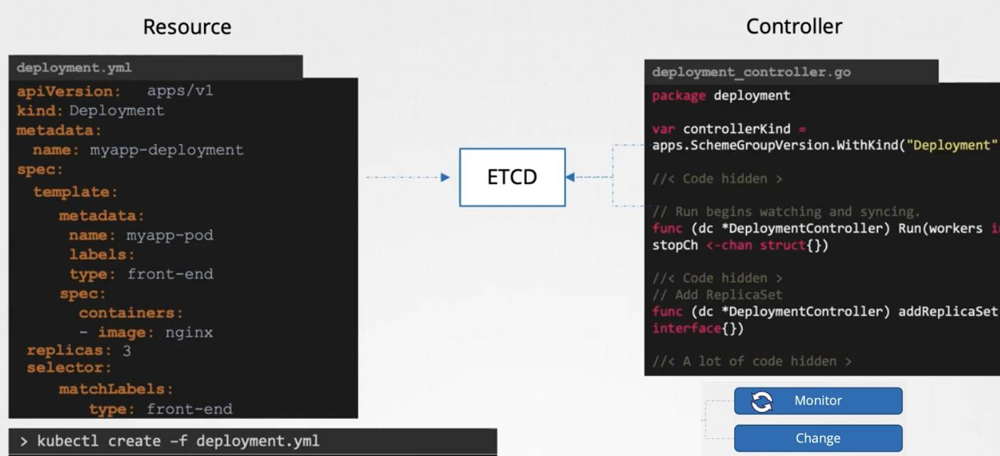
  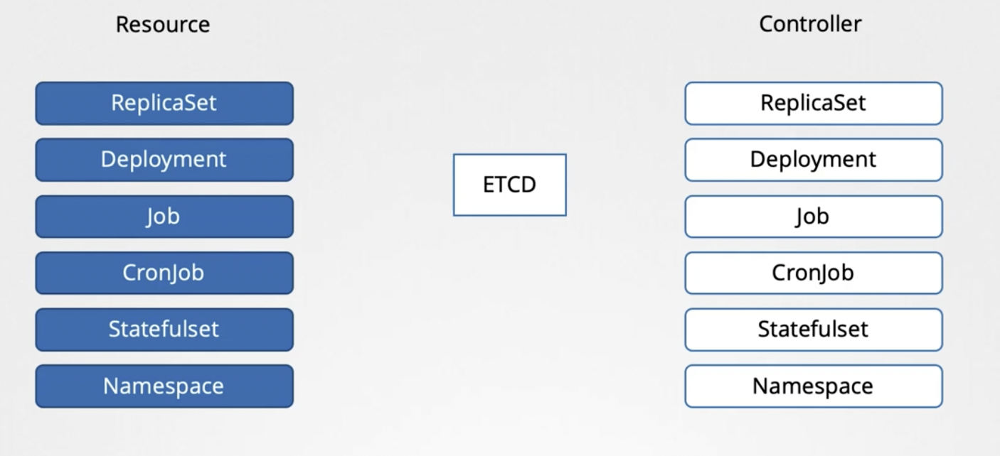
- But we can create custom resources it controller for maintaining status of those resource. For example if want to create a Custom Resource for booking flights and a Custom controller for it:
  - Create CRD like this (and then run `kubectl create -f my-flight-ticket-crd.yaml`):
    ```yaml
    apiVersion: apiextensions.k8s.io/v1
    kind: CustomResourceDefinition
    metadata:
      name: flighttickets.flights.com # any name
    spec:
      scope: Namespaced # Whether we want to be NS scoped or Cluster scoped
      # We'll use 'group' in 'apiVersion' the resource definition. E.g: 'apiVersion: flights.com/v1' here
      group: flights.com
      names:
        # 'kind' will be exactly used in 'kind' of resource create definition
        kind: FlightTicket
        # signular and plural names will be used but kube api server. You can see them in `kubectl api-resources`
        singular: flightticket
        plural: flighttickets
        shortnames: # aliases or shortnames of the resource
          - ft
      versions:
        - name: v1 # We'll use version in 'apiVersion' of resource creattion def.
          served: true
          storage: true # If we have multiple versions, only one of them should have 'storage=true'
      schema:
        # We define all the parameters in 'spec' section of the resource creation def
        openAPIV3Schema:
          type: object
          properties:
            # These are hard data types, means the user will receive error if don't follow the data types.
            spec:
              from:
                type: string
              to:
                type: string
              number:
                type: integer
                minimum: 1
                maximum: 10
    ```
  - But we also need a Controller for this CRD. Otherwise, the if we create a object from this CRD, the object won't do any action, neither will be checked for the status.
  - You can create Custom Controllers with languages like Python, but the communication with Kubernetes apiserver will be challenging. The best way is to write it in Golang.
    - Get sample controller from [here](https://github.com/kubernetes/sample-controller), develop the business logic inside (like booking flight).
    - Then build the code with `go build -o sample-controller .`
    - We can run it using `./sample-controller -kubeconfig=$HOME/.kube/config`, but the better way is containerise it as Docker, and deploy as a Pod to kubernetes

- 2 additional concepts: 
  - Operators: These are special programs that help manage complex applications on Kubernetes. They use CRDs (to define custom resources) and custom controllers (to watch and act on those resources). Think of an operator as a helper that watches over your application and fixes issues automatically.
  - Operator Frameworks: These provide ready-made tools, libraries, and guidelines to create these helpers (operators) without starting from scratch. They simplify tasks like setting up the operator, testing it, and deploying it on Kubernetes.
  - You can find tons of Operators from [Here](https://operatorhub.io/)

- Note about the exam: Only learn CRD creation.

# Storage
**Understanding Storage in Docker**
We can 2 concept in Docker:
1. Storage Drivers
  - When we create run `docker build` command, Docker will cache the steps (each like in Dockerfile is one step or one layer). For the next `docker build`s, Docker will used the cached steps of previous `build` until it see the first different step.
    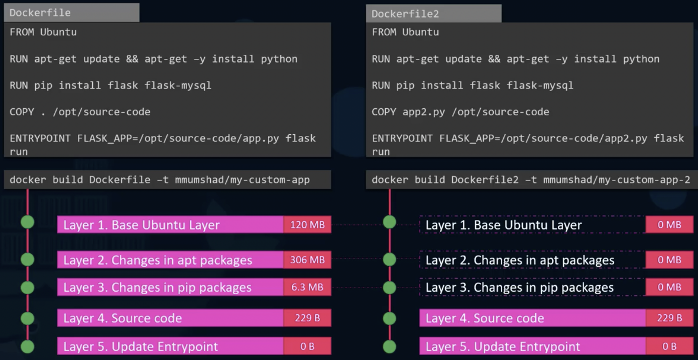
  - All of of *image layer* steps are read only. But any data that is created after `docker run` (Container layer) command can be modified. When we remove the container, all the data created in "container" layer will be destroyed.
    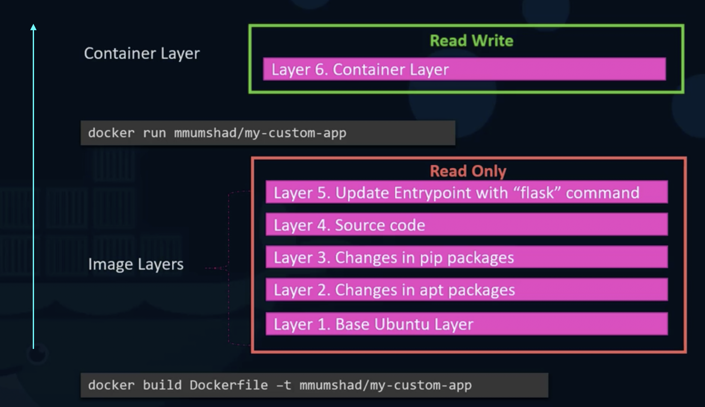
  - What should we do if we want some of our data to resist when the Container got restarted? Create volumes:
    - **Bind mounting** is mounting existing directory of host machine to the container. **Volume mounting** is mounting a volume (that is locate in /var/lib/docker/volumes of host machine). Storage Drivers are responsible to bind mounting and volume driver plugings are responsible to volume mounting.
    - First create volume in host machine (/var/lib/docker/volumes) using `docker volume create <volumeName>`
    - Attach volume to the container on creation `docker run -v <volumeName>:/var/lib/mysql mysql`
    - We can even attach an exisiting directory in our machine (bind mounting). For this, use absolute path like `docker run -v /data/mysql:/var/lib/mysql mysql`
    - A newer way of attaching volume is better and recommended: `docker run --mount -type=bind,source=<dirInHost>,target=<dirInContainer> mysql`
    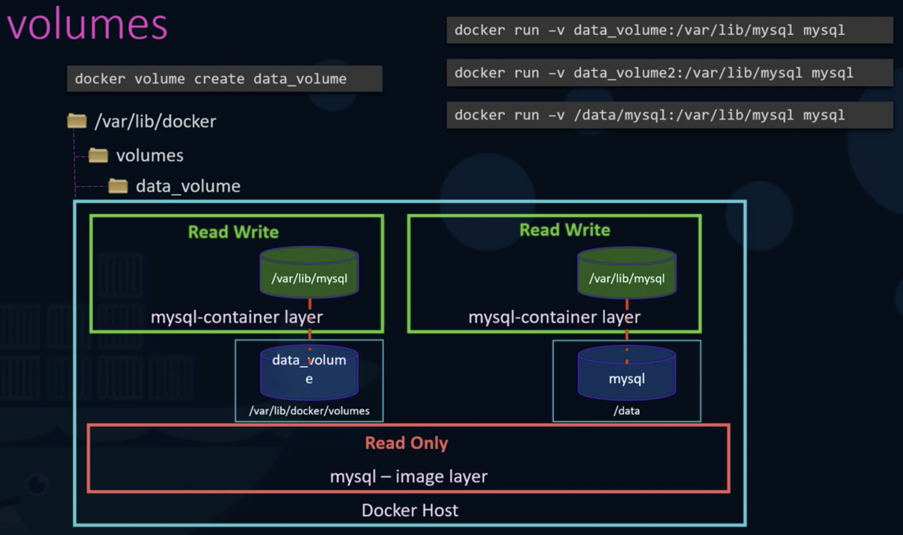
  - Who is responsible to maintaining this mounting a directory (not volume) of host machine to the container? **Storage Drivers**. There are some storage drivers (like `AUFS`, `ZFS`, `BTRFS`, so on). Docker will the best one for us based on the OS we choose in image. But we can also define it manually.

2. Volume Drivers
  - We saw that we can mount volumes to container. **Volume Drivers** are responsible to do this operation. There are many volume driver plugins like *Local*, *Azure File Storage*, *Convey*, *DigitalOcean Block Storage*, *RexRay*, etc. We can define the plugin on docker run command
  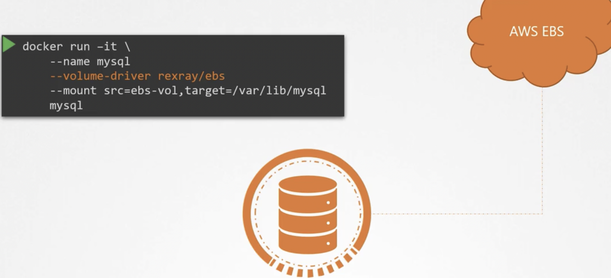

**Back to Kubernetes**
- Over the time, K8s team added interfaces, then other developers can develop solutions for those areas without needing to work with k8s team:
  - CRI (Container Runtime Interface). Container runtimes that follow this interface and can connect k8s using CRI: Docker, rkt, cri-o, ...
  - CNI (Container Network Interface). Solutions that follow this interface and can extend networking features of k8s: weaveworks, flannel, cilium, ...
  - CSI (Contaienr Storage Interface). Solutions that follow this interface and has been developed to work with different storage types of k8s: Amazon EBS, GlusterFS, DELL EMC, ...
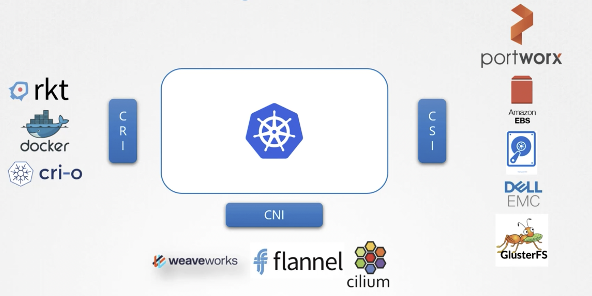

- As we see in the image below, both Orchestration and Storage Plugins follow the RPC protocol interface. So, when we want to create a volume in k8s, it calls the `CreateVolume` procedure of the Storage Plugin (k8s doesn't need to know which Storage plugin it is)
  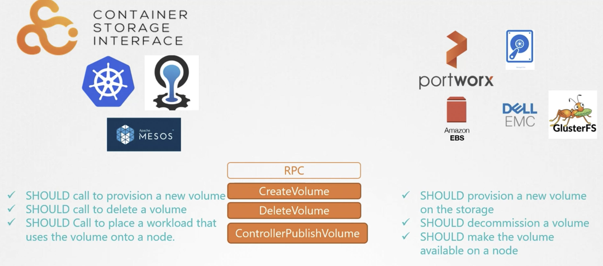

## Volumes
- A simple definition for a Pod with a Volume mounted:
  ```yaml
  kind: Pod
  # ...
  spec:
    containers:
      - #...
        command: ["/bin/sh", "-c"]
        args: ["shuf -i 0-100 -n 1 >> /opt/number.out;"]
        volumeMounts:
          - mountPath: /opt
            name: my-data-volume-in-container
    volumes:
      - name: my-data-volume
        type: Directory
        path: /path-in-host
  ```
- If we use different storage solutions, like AWS EBS:
  ```yaml
  #...
    volumes:
      - name: my-ebs-volume
        awsElasticBlockStore:
          volumeID: <volume-id>
          fsType: ext4
  ```

### Persistent Volumes (PV)
- While we can define volume in Pod definition itself, it's highly recommended to create PV (Persistent Volumes). Means, we create Volumes separately and attach them to any Pods we want. As an example for its benefits is that the k8s admin can create several PVs, and k8s users (like developer) can attach one of those PVs to their Pods, without need to deal with volume provisioning.
  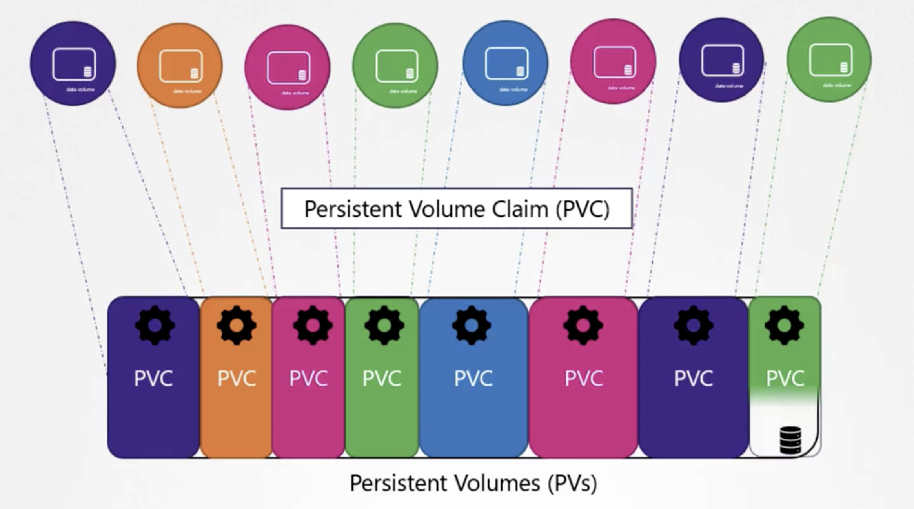
- To create PVs:
  ```yaml
  apiVersion: v1
  kind: PersistentVolume
  metadata:
    name: my-pv-vol1
  spec:
    accessModes:
      # Available Options: 'ReadOnlyMany', 'ReadWriteOnce', 'ReadWriteMany'
      - ReadWriteOnce
    capacity:
      storage: 1Gi
    hostPath:
      path: /tmp/data
    
    # OR we can replace with stoge plugins like AWS EBS like this:
    awsElasticBlockStorage:
      volumeID: <volume-id>
      fsType: ext4
  ```
- To list PVs, run `kubectl get peristentvolume` or `k get pv`

### Persisten Volume Claims (PVC)
- PV and PVCs are separated objects.
  - Admin creates PVs, but it's not allocated to any Pod yet.
  - The user (like developer or admin himself) creates a PVC.
  - Based on PVC, k8s looks between all available PVs to find the maching properties (like Sufficient Capacity, Access Modes, Volume Modes, Storage Class, so on).
    - If we know that there are several mathcing PVs with our PVC, we can filter using `selector` in PVC
  - k8s bind the PVC to the chosen PVC
- There is **One to One** relationship between PV and PVC. PV can be use by only one PVC at a time, even if there is available capacity in PV. 
  - In other words, if capacity of claim was 50Mi and PV's capacity was 100Mi, the claim's capacity will be 100Mi if it claims the PV successfully.
- If there are no available mathing PV, then PVC will stay in Pending state until a proper PV made available.
- Definition of PVC:
  ```yaml
  apiVersion: v1
  kind: PersistentVolumeClaim
  metadata:
    name: my-pvc
  spec:
    # k8s will look for any PV with look for any storage with 'ReadWriteOnce' accessMode and storage capacity >500Mi
    accessModes:
      - ReadWriteOnce
    resources:
      requests:
        storage: 500Mi
  ```
- To see PVCs and bounded volumes: `kubectl get persistentvolumeclaim` or `k get pvc`
- To delete a PVC, run `k delete pvc my-pvc`. But happens to the underlying PV? It has 3 strategy options (define them in `spec` of PV):
  - `persistentVolumeReclaimPolicy: Retain`
    - Default behaviour is to Retain the PV. Means prevents any other PVC to claim it.
  - `persistentVolumeReclaimPolicy: Delete`
    - Deletes the volume
  - `persistentVolumeReclaimPolicy: Recycle` (Deparecated. Use dynamic volumes instead)
    - The data in the volume will be scrubed (`rm -rf /thevolume/*`) before being available for getting claimed.
- To specify PVC in Pod definitions:
  ```yaml
  kind: Pod
  #...
  spec:
    containers:
      - #...
        volumeMounts:
          - mountPath: "/var/www/html"
            name: my-volume
    volumes:
      - name: my-volume
        persistentVolumeClaim:
          claimName: myclaim
  ```
- If a PVC mounted to a Pod, and we try to delete the PVC, it'll stay in terminating status until the Pod is running. As soon as Pods get deleted, PVC will be deleted.

### Storage Classes
- What should we do if we want to mount a volume from our provider (like GCP, AWS, so on)?
  - One way is that every time we wanted a storage, create a disk on the provider manually, then create a PV that connects to that disk, like this:
    ```yaml
    kind: PersistentVolume
    #...
    spec:
      # ...
      gcePersistentMode:
        pdName: my-pd-dist
        fsType: ext4
    ```
  - But there is an easier solution for this. We can create **Storage Classes** like this:
    ```yaml
    apiVersion: storage.k8s.io/v1
    kind: StorageClass
    metadata:
      name: my-gcp-goldplan-storage
    privisioner: kubernetes.io/gce-pd
    # This parameters section can be different for each provider
    parameters:
      type: pd-standard # Or 'pd-ssd'
      replication-type: none # or 'regional-pd'
    ```
  - With this way, we don't need to create PV manually anymore. We just create Claim, and it calls the Storage Class, and storage class will privision a disk with required size for the claim automatically:
    ```yaml
    kind: PersistentVolumeClaim
      # ...
    spec:
      storageClassName: my-gcp-goldplan-stoarge # This is the line to connect to storage class
      accessModes:
        - ReadWriteOnce
      resoureces:
        # ...
    ```

# Networking
## Netwoking Basics
### Routing Switch
- Our focus here is Linux machines.
- How does 2 computers can reach each other? If we want both of them to be part of one local network:
  - We connect them to a Switch, and the Switch creates a network contains 2 computers. Both of the systems should have Network Interface. To see the network interface, run `ip link`
  - Now, to assume a network for each machine, run command to get IP address: `ip addr add 192.168.1.10/24 dev eth0`. Now, the computers can ping each other.
    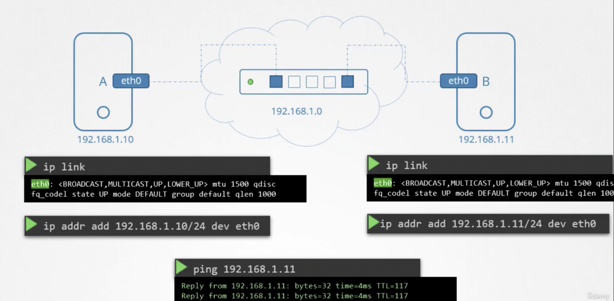
- If the 2 machines aren't in the same network:
  - We can connect them to each other using Router. The router is another device in the Network. We need to tell the machine that use Router to reach the machine in other Network using defining Gateways like this: `ip route add 192.168.2.0/24 via 192.168.1.1`. This has to be done in all the systems in both sides to be able to reach each other.
  - To see existing route gateways: `route`
    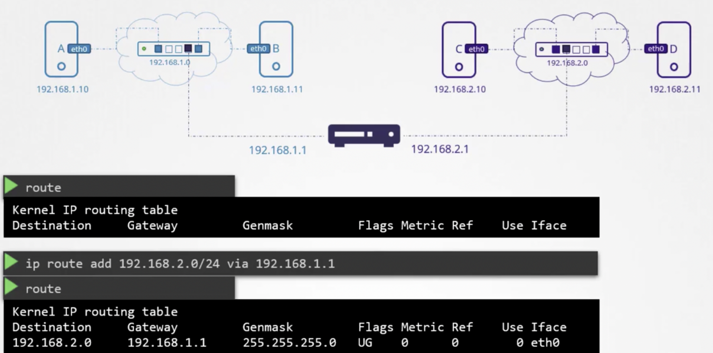
- If we want these systems to access to internet
  - We can run `ip route add default via 192.168.2.1` on each machine. This command means for any IP that couldn't find in route list, use the router to reach out. This *internet connecting gateway route* can be different from the routes for connecting local machines.
  - So, if we have internet issue on our machine, this this routes and default routes are good place too start
- How we can setup a Linux host as a Router?
  - In all machines, we add route to reach out to the network via that host machine, like this: `ip route add 192.168.2.0/24 via 192.168.1.6`
  - But because Linux doesn't packet forwarding from one network to the other, the machines still cannot reach each other (like Ping). To packet forwarding, we should run `echo 1 > /proc/sys/net/ipv4/ip_forward`. If you want this value persist on restarts, change the content inside `/etc/sysctl.conf` to `net.ipv4.ip_forward = 1`

- Commands:
  - `ip link` . List and modify interfaces on the host
  - `ip addr` . To see IP addresses assigned to those interfaces
  - `ip addr add 192.162.1.10/24 dev eth0` . To set IP addresses on the interfaces (doesn't persists on restart)
  - `ip route` and `route` . To view route table
  - `ip route add 192.168.1.0/24 via 192.168.2.1`. To add entries to route table
  - `cat /proc/sys/net/ipv4/ip_forward` . To check whether IP forward is enabled
  - `arp` . To list ARPs
  - `netstat -plnt`

### DNS
- Instead of using the IP of machine to reach to (like when want to ping `ping 192.168.1.11`), we can define alias for it with adding record to `/etc/hosts` file like `192.168.1.11    db`. Now we can use `ping db`. We can do this for public websites like `google.com` as well. This concept is called **Name Resolution**.
  - But if we have a lot of machines in the network, managing huge list will be hard. We can ease it by introducing a DNS server which is responsible for Name Resolution. Just put the records in that DNS machine. Then tell the machines to use that DNS machine by add `nameserver {DNS_MACHINE_IP}` to `/etc/resolv.conf` file of all machines.
  - Note that, the machine first looks for records in `etc/hosts` FIRST, then if not exists there, it will look in DNS server. But we can change this behaviour by modifying the file `/etc/nsswitch.conf`. By default it has `hosts: files dns`. But we can make it `hosts: dns files`
  - Public well-know DNS servers have a huge list of all websites on the internet. So, by adding them, all domain names (like facebook.com, google.com, etc) will be accessible in our machine. One popular DNS resolver is `8.8.8.8`. We'll add it to `/etc/resolv.conf`: `nameserver 8.8.8.8`.
  - Instead of putting public DNS resolver on each machine, we can also put it in our DNS resolver using `Forward All to 8.8.8.8`
  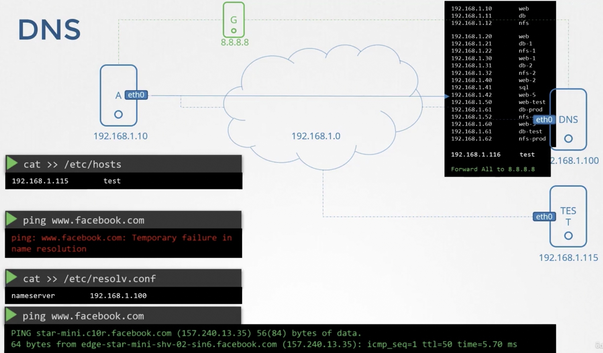
- What if we regularly query to subdomains of our company domain, but want to use shorten way only? For example, instead of `ping db.mycompany.com`, we be able to just call `ping db`? Just add `search mycompany.com` in `resolv.conf` file. Even can define several records like `search mycompany.com dev.mycompany.com`
- We can also use `nslookup` or `dig` tools instead of `ping` to find resolve domain, but they don't look at `etc/hosts` file's content
- There are different solutions to setup DNS server. One good option is CoreDNS. After installation, you can either import records from /etc/hosts file or other ways.

### Network Namespaces
- Namespaces is like rooms in a house. Parent of house can see processes of rooms, but children can see processes in their room only.
- The host machine has a Network Interface, Routing Table and ARP Table to communicate with world outside (like local network). But we can also define virtual interfaces, Routing table and ARP table for the Namespace (or Container)
  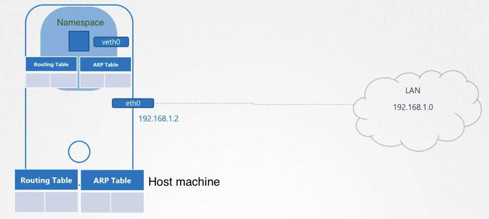  
  - First of all, we create Namespaces:
    - `ip netns add red`, `ip netns add blue`. Then run `ip netns` to list
    - How to run command inside NS? By appending `ip netns exec {Namespace}`. E.g `ip netns exec red ip link`.
      - A short form for `ip netns exec {namespace} ip ...` is `ip -n red ...`. E.g `ip netns exec red ip link` -> `ip -n red link`
  - Now if we run `ip netns exec red ip link` and `ip netns exec red arp` we won't see any network interfaces and ARP. Because namespace can't see host's ones.
  - We can establish network between 2 namespaces using Pipe (virtual ethernet pair)
    - Create the cable with 2 ends first using `ip link add my-veth-red type veth peer name my-veth-blue`
    - Attach each end of cable to namespaces: `ip link set my-veth-red netns red` and `ip link set my-veth-blue netns blue`
    - Assign IP within each namespace `ip -n red addr add 192.168.15.1 dev my-veth-red` and `ip -n blue addr add 192.168.15.2 dev my-veth-blue`
    - Now bring up the interfaces: `ip -n red link my-veth-red up` and `ip -n blue link my-veth-blue up`
    - Now 2 namespaces can reach out to each other. Test it by ping each other: `ip netns exec red ping {ip_of_veth_blue}`
    - You can see ARP of both NSes `ip netns exec red arp` and `ip netns exec blue arp`. Note that the host machine is not aware or these ARPs.
    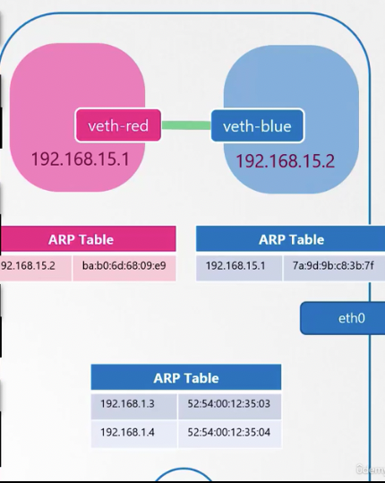
  - What if we have many namespaces and want to establish connection between them? We should create a virtual switch. From available solutions, we're going to use *Linux Bridge* option
    - Create the virsual network using `ip link add v-net-0 type bridge` and up it using `ip link set dev v-net-0 up`
    - If we already created link and want to delete, use `ip -n red del my-veth-red`. It'll also delet other end of the pair
    - Create cable to connect first namespace to the newly create bridge using `ip link add my-veth-red type veth peer name my-veth-red-br`
    - Attach first side of cable to the NS using `ip link set my-veth-red netns red`
    - Attach the other end to the bridge using `ip link set my-veth-red-br master v-net-0`
    - Assign IP to NS using `ip -n red addr add 192.168.15.1 dev my-veth-red`
    - Up the network of NS using `ip -n red link set my-veth-red up`
    - Follow the last 5 steps for other Namespaces as well.
      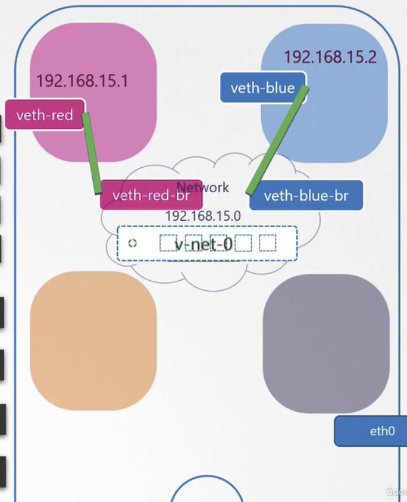
    - Now all the namespaces can communicate with each other. But because the host and Namespaces are in different network, host machine can't reach the namespaces. How can we solve it, just with assigning an IP to the Bridge using `ip add addr 192.168.15.5/24 dev v-net-0`
    - Note that this Namespaces are isolated from world outide. 
  - The namespaces that we created in the last stage do not have access to the world outside, like the other computers in the local network. To give this access:
    - Add a route to each namespace to reach to IP range through host machine: `ip netns exec blue ip route add 192.168.1.0/24 via {IP_OF_HOST_WITHIN_NAMESPACES_NETWORK}`
    - Enable NAT functionality in host machine using: `iptables -t nat -A POSTROUTING -s 192.168.15.0/24 -j MASQUERADE`. Actually, the computers in the local network will think the request comes from the host mahine, not the namespaces inside it. Because iptables will replace FROM of all packets to host machine's IP.
      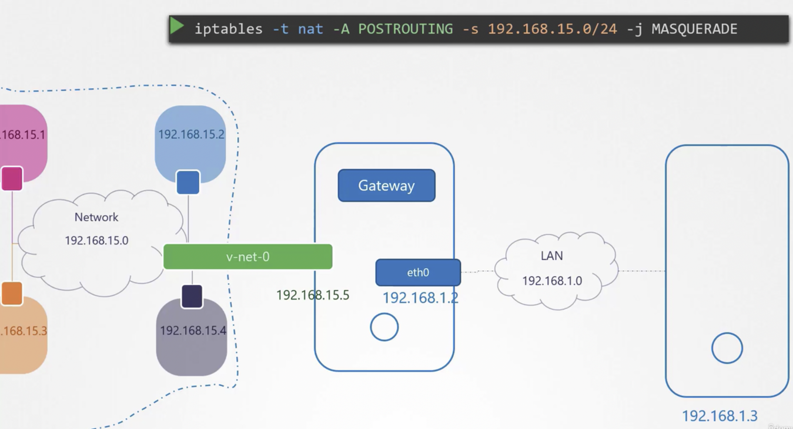
    - To enable internet access for namespaces, just add default route to each namespace `ip netns exec blue ip route default via {IP_OF_HOST_WITHIN_NAMESPACES_NETWORK}`
      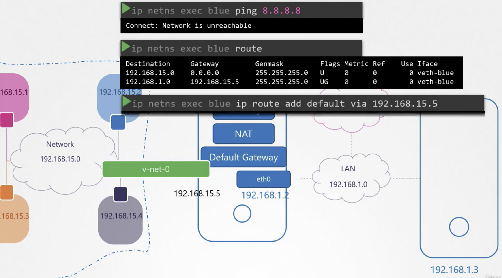
    - If we want the namespaces be accessible from outside (like if our webapp is in namespace), a good way is port forwarding: `iptables -t nat -a PREROUTING --dport 80 --to-destination 192.168.15.2:80 -j DNAT`
      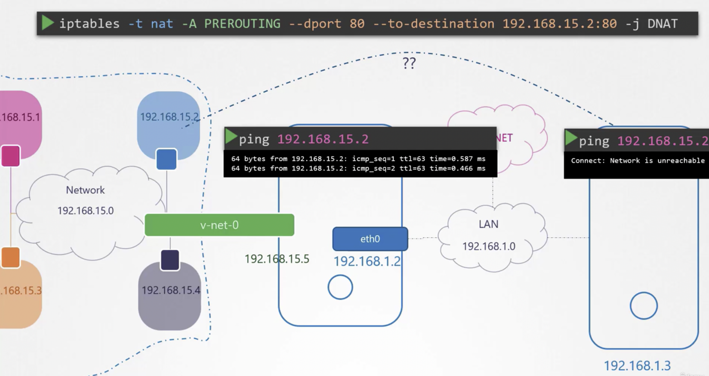
  - While testing the Network Namespaces, if you come across issues where you can't ping one namespace from the other, make sure you set the NETMASK while setting IP Address. ie: 192.168.1.10/24 `ip -n red addr add 192.168.1.10/24 dev veth-red`. Another thing to check is FirewallD/IP Table rules. Either add rules to IP Tables to allow traffic from one namespace to  another. Or disable IP Tables all together (Only in a learning environment).

## CNI (Container Network Interface)
- Since all namespace networking solutions should follow the similar steps (as we below in the picture), CNI standard has been introduced. So, if both the Network plugin and the Runtime (like kubernets) will follow it, Runtime can use the plugin as its network solution.
  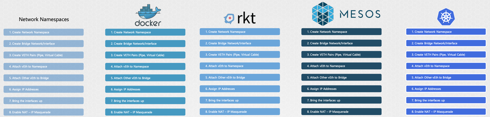
- Any CNI solution should be able to create a bridge using command `bridge add <cid> <namespace>`
- Some of container runtimes that implement CNI: weaveworks, flannel, cilium, vmware NGX.
  - But Docker has its own implementation which is called `CNM` (Container Network Model). So, we can't create Docker container using CNI-implemented solutions `docker run --network=cni-bridge`. So, how k8s will use network solutions to create bridge in Docker containers? k8s create Docker container without network `docker run --network none <image>` behind the scenes and then invoke the configured CNI plugin to take care of NS configurations `bridge add <container-id> <namespace>`.

## k8s Cluster Networking
- The following pictures shows ports of different k8s components. So, keep them in mind when you want to allow them in firewall or Cloud Security Group configurations:
  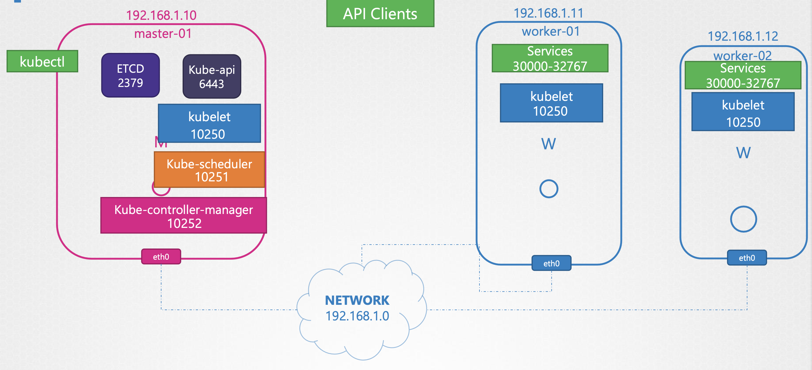
  - Note that if we have several master nodes, we should allow ports in all of them. In addition, we should allow port `2380` in all master nodes, because of ETCD

### Docker Networking
- Docker has several networking options:
  - None (`docker run --network none nginx`): Means the container won't get attach to any network.
  - Host (`docker run --network host nginx`): Means the containers will be attach to the network of host. Means if the appliation of container runs on port 80, it'll use port 80 of host. So, another application can't use this port anymore
  - Bridge (`docker run --network bridge nginx`): Means the container will use the Bridge network that Docker created for its containers. Docker will use network swithing method we discussed above to establish connection between containers and also with the world outside.
    - In this option, if we want application (container) be accessible from the outside of host machine, we use port forwarding `docker run -p {hostPort}:{containerPort} nginx`. Docker use iptables NAT PREROUTING behind the scenes.
- We can see Network interfaces of Docker using `docker network ls`. 
- We can see namespace of containers using `docker inspect {containerId}`, section `networkSetting`
- For each container, Docker creates a namespace. And create cables between bridge and namespaces

# Additional Commands
 
- Get all running components in groups: `kubectl get all`
- To keep live watch on any get command in k8s, add --watch param. E.g `kubetctl get po --watch`
- If we want to get count of resources (Pod here)
  `kubectl get po --no-headers | wc -l` .

# References & Cheat Sheets

- [Kubernetes Quick Reference](https://kubernetes.io/docs/reference/kubectl/quick-reference/)
- [kubectl useful commands](https://faun.pub/kubectl-useful-commands-f5f47c0773f)
- [Kubernetes Awesome](https://awesome-architecture.com/devops/kubernetes/kubernetes/)

# Kubernetes Resources aliases
You can get this list using `kubectl api-resources`

- `po` : Pods
- `rs` : ReplicaSets
- `deploy` : Deployments
- `svc` : Services
- `ns` : Namespaces
- `netpol` : Network policies
- `pv` : Persistent Volumes
- `pvc` : PersistentVolumeClaims
- `no` : Nodes
- `rc` : ReplicationController
- `sec` : Secret
- `cm` : ConfigMap
- `ep` : Endpoint
- `limits` : LimitRange
- `quota` : ResourceQuota
- `sa` : ServiceAccount
- `sts` : StatefulSet
- `ds` : DaemonSet
- `cj` : CronJob
- `ing` : Ingress
- `netpol` : NetworkPolicy
- `sc` : StorageClass
- `va` : VolumeAttachment

### Arguments:
- `-n=` : `--namespeces=`
- `-A` : `--all-namespaces`

# Useful k8s tools
- [kubectx](https://github.com/ahmetb/kubectx) . Faster way to switch between contexts (clusters) and namespaces in kubectl

# Exam Tips
- ✅ During the exam, you will have access to :
  - Kubernetes official documentation
  - kubectl CLI reference (e.g., kubectl explain pod)
  - Man pages & --help command (e.g., kubectl --help)
  - YAML schema references
- 🚫 However, you will NOT have access to:
  - Google or other search engines
  - Third-party sites like Stack Overflow, Medium, or personal notes
- Always verify your performed change during the exam. Like check your created Pod is READY. 
- k8s in exam has been installed using `kubeadm`  which
  - already deployed etcd, Kube-Apiserver, Kube-Scheduler, Kube-Controller-Manager as Pods
- During the exam, if `k` alias is not set, set it yourself by running `alias k=kubectl`
- Createing YAML files are time consuming during the exam. Instead try to use imperative commands as much as possible. If complex changes required (like multiple containers, env variables, so on) try to use dry-run to save time by creating template YAML.
  - Create an NGINX Pod 
    - `kubectl run nginx --image=nginx`
  - Generate POD Manifest YAML file (-o yaml). Don't create it(--dry-run) 
    - `kubectl run nginx --image=nginx --dry-run=client -o yaml`
  - Create a deployment
    - `kubectl create deployment --image=nginx nginx`
  - Generate Deployment YAML file (-o yaml). Don't create it(--dry-run)
    - `kubectl create deployment --image=nginx nginx --dry-run=client -o yaml`
  - Generate Deployment YAML file (-o yaml). Don’t create it(–dry-run) and save it to a file.
    - `kubectl create deployment --image=nginx nginx --dry-run=client -o yaml > nginx-deployment.yaml`
  - Make necessary changes to the file (for example, adding more replicas) and then create the deployment.
    - `kubectl create -f nginx-deployment.yaml`

  - In k8s version 1.19+, we can specify the --replicas option to create a deployment with 4 replicas.
    - `kubectl create deployment --image=nginx nginx --replicas=4`
        
      or export to YAML:
    - `kubectl create deployment --image=nginx nginx --replicas=4 --dry-run=client -o yaml > nginx-deployment.yaml`
- Some additional sample commands useful in exam:
  - `kubectl edit deployment nginx`
  - `kubectl scale deployment nginx --replicas=5`
  - `kubectl set image deployment nginx nginx=nginx:1.18`
  - For creating **service** we have 2 ways. Each one of them has its own challenge. The first one can't have selector, the second one can't have node port. But overally `expose` is more recommended, then modify YAML file:
    1. Using Expose:
       - `kubectl expose pod redis --port=6379 --name redis-service --dry-run=client -o yaml` . Example for ClusterIP
       - `kubectl expose pod nginx --type=NodePort --port=80 --name=nginx-service --dry-run=client -o yaml` . For NodePort
     2. Using Service:
        - `kubectl create service clusterip redis --tcp=6379:6379 --dry-run=client -o yaml` . Example for ClusterIP
        - `kubectl create service nodeport nginx --tcp=80:80 --node-port=30080 --dry-run=client -o yaml` . Example for NodePort
- If you forgot the commands' exact form, just use `--help`. For example:
  - `kubectl create service --help`
  - `kubectl create service clusterip --help`
  - `kubectl set image --help`
- To inspect component errors, use one of the following ways:
  - `kubectl logs <componentName>`
  - `crictl ps -a` to list components, then `crictl logs containerId` to find the problem.
  - `journalctl -u <serviceName>`
  - **Note**: Most of the times, you can start finding problem from apiserver component, because every other component talks to kube-apiserver